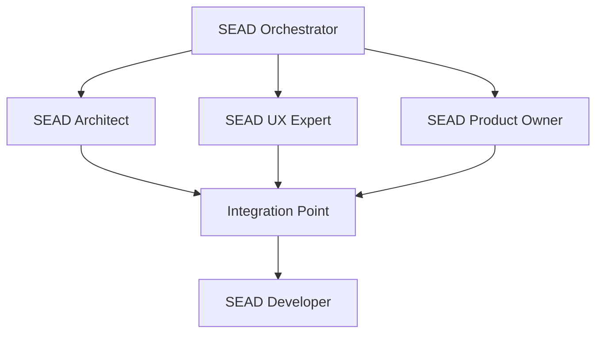
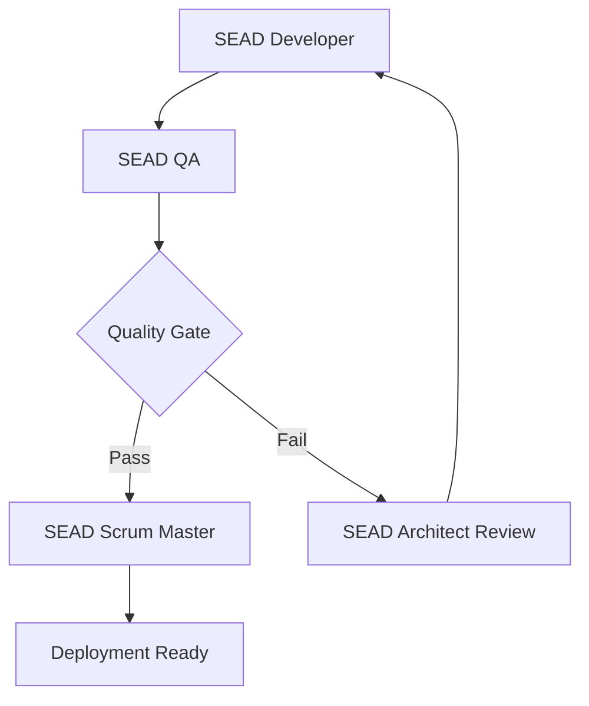

# SEAD-METHOD™ Agent Coordination Guide

**Version**: 1.3.3  
**Date**: 2025-01-15  
**Status**: Production Ready

## Table of Contents

1. [Introduction](#introduction)
2. [Agent Ecosystem Overview](#agent-ecosystem-overview)
3. [Agent Tiers and Responsibilities](#agent-tiers-and-responsibilities)
4. [Coordination Patterns](#coordination-patterns)
5. [Workflow Orchestration](#workflow-orchestration)
6. [Context Preservation](#context-preservation)
7. [Constitutional Handoffs](#constitutional-handoffs)
8. [Multi-Agent Scenarios](#multi-agent-scenarios)
9. [Troubleshooting Agent Coordination](#troubleshooting-agent-coordination)
10. [Advanced Coordination Patterns](#advanced-coordination-patterns)

---

## Introduction

SEAD-METHOD™ employs a sophisticated 12-agent ecosystem where specialized AI agents collaborate to deliver high-quality software development. Each agent operates within constitutional constraints and maintains catalog awareness, ensuring consistent, coordinated development outcomes.

### Key Coordination Principles

- **🏛️ Constitutional Compliance**: All agents operate within defined constitutional constraints
- **📚 Catalog Awareness**: Every agent maintains awareness of project catalog patterns
- **🔄 Context Preservation**: Information flows seamlessly between agents
- **⚖️ Tiered Governance**: Different constraint levels based on drift risk
- **🎯 Role Clarity**: Clear responsibilities prevent overlap and confusion

---

## Agent Ecosystem Overview

### The 12 SEAD Agents

#### Tier 1: Core Development Agents (High Technical Risk)
- **SEAD Developer**: Implementation and code generation
- **SEAD Architect**: System design and technical architecture
- **SEAD QA**: Quality assurance and testing validation

#### Tier 2: Coordination Agents (Medium Consistency Risk)
- **SEAD Scrum Master**: Process facilitation and team coordination
- **SEAD Catalog Architect**: Pattern design and catalog management
- **SEAD Product Owner**: Requirements and backlog management
- **SEAD UX Expert**: User experience and design system coordination

#### Tier 3: Analysis Agents (Low Drift Risk)
- **SEAD Pattern Extraction**: Pattern identification and classification
- **SEAD Analyst**: Requirements analysis and documentation
- **SEAD Project Manager**: Project planning and risk management

#### Tier 4: Orchestration Agents (Inherit All Constraints)
- **SEAD Master**: Universal task execution and agent coordination
- **SEAD Orchestrator**: Multi-agent workflow coordination and context management

### Agent Interaction Matrix

| Agent | Primary Collaborators | Key Handoff Points |
|-------|----------------------|-------------------|
| **SEAD Master** | All agents | Universal task delegation |
| **SEAD Orchestrator** | All agents | Workflow coordination |
| **SEAD Analyst** | Product Owner, Project Manager | Requirements → Planning |
| **SEAD Architect** | Developer, QA, UX Expert | Design → Implementation |
| **SEAD Developer** | Architect, QA, Scrum Master | Implementation → Testing |
| **SEAD QA** | Developer, Architect, Scrum Master | Testing → Deployment |
| **SEAD Product Owner** | Analyst, UX Expert, Scrum Master | Requirements → Stories |
| **SEAD UX Expert** | Architect, Developer, Product Owner | Design → Implementation |
| **SEAD Project Manager** | All agents | Planning coordination |
| **SEAD Scrum Master** | Developer, QA, Product Owner | Process facilitation |
| **SEAD Catalog Architect** | All technical agents | Pattern governance |
| **SEAD Pattern Extraction** | Catalog Architect, Analyst | Pattern → Catalog |

---

## Agent Tiers and Responsibilities

### Tier 1: Full Constitutional Constraints (High Technical Drift Risk)

#### SEAD Developer
- **Primary Role**: Code implementation and technical execution
- **Constitutional Requirements**: 
  - Must read catalog patterns before implementation
  - Enforces coding standards and architectural compliance
  - Validates against design system patterns
- **Coordination Responsibilities**:
  - Receives specifications from SEAD Architect
  - Provides implementation status to SEAD Scrum Master  
  - Submits code for SEAD QA validation

#### SEAD Architect
- **Primary Role**: System design and technical architecture
- **Constitutional Requirements**:
  - Must validate catalog compatibility before design decisions
  - Enforces architectural patterns and constraints
  - Maintains system integrity across components
- **Coordination Responsibilities**:
  - Receives requirements from SEAD Product Owner
  - Provides specifications to SEAD Developer
  - Collaborates with SEAD UX Expert on system design

#### SEAD QA  
- **Primary Role**: Quality assurance and testing validation
- **Constitutional Requirements**:
  - Must validate against catalog quality gates
  - Enforces testing standards and coverage requirements
  - Prevents deployment of non-compliant code
- **Coordination Responsibilities**:
  - Receives implementations from SEAD Developer
  - Provides quality feedback to SEAD Scrum Master
  - Validates architectural compliance with SEAD Architect

### Tier 2: Catalog-Aware Constraints (Medium Consistency Risk)

#### SEAD Scrum Master
- **Primary Role**: Process facilitation and team coordination
- **Catalog Awareness**: Story patterns, process templates, team coordination
- **Coordination Responsibilities**:
  - Facilitates handoffs between development agents
  - Manages sprint planning and retrospectives
  - Escalates blockers to appropriate agents

#### SEAD Catalog Architect
- **Primary Role**: Pattern design and catalog management  
- **Catalog Awareness**: All catalog domains, pattern evolution
- **Coordination Responsibilities**:
  - Provides pattern guidance to all technical agents
  - Maintains catalog integrity and evolution
  - Reviews patterns from SEAD Pattern Extraction

#### SEAD Product Owner
- **Primary Role**: Requirements and backlog management
- **Catalog Awareness**: Story patterns, acceptance criteria templates
- **Coordination Responsibilities**:
  - Receives analysis from SEAD Analyst
  - Provides requirements to SEAD Architect
  - Collaborates with SEAD UX Expert on user needs

#### SEAD UX Expert
- **Primary Role**: User experience and design system coordination
- **Catalog Awareness**: Design system patterns, UI components, UX templates  
- **Coordination Responsibilities**:
  - Provides design guidance to SEAD Architect and Developer
  - Collaborates with SEAD Product Owner on user requirements
  - Validates user experience with SEAD QA

### Tier 3: Guidance Frameworks (Low Drift Risk)

#### SEAD Pattern Extraction
- **Primary Role**: Pattern identification and classification
- **Guidance Framework**: Pattern analysis best practices, catalog contribution
- **Coordination Responsibilities**:
  - Analyzes existing codebases for patterns
  - Provides pattern recommendations to SEAD Catalog Architect
  - Supports brownfield analysis workflows

#### SEAD Analyst
- **Primary Role**: Requirements analysis and documentation
- **Guidance Framework**: Analysis methodologies, documentation standards
- **Coordination Responsibilities**:
  - Receives project requirements from stakeholders
  - Provides analysis to SEAD Product Owner
  - Supports SEAD Project Manager with impact analysis

#### SEAD Project Manager
- **Primary Role**: Project planning and risk management
- **Guidance Framework**: Project management best practices, risk assessment
- **Coordination Responsibilities**:
  - Coordinates project timeline and resources
  - Provides planning support to all agents
  - Manages project risks and dependencies

### Tier 4: Aggregate Agent Frameworks (Inherit All Constraints)

#### SEAD Master
- **Primary Role**: Universal task execution and agent coordination
- **Inherited Constraints**: All constitutional constraints from other agents
- **Coordination Responsibilities**:
  - Can execute any SEAD task by invoking appropriate agents
  - Maintains context across multi-agent workflows
  - Provides unified interface for complex operations

#### SEAD Orchestrator
- **Primary Role**: Multi-agent workflow coordination and context management
- **Inherited Constraints**: All constitutional constraints from other agents  
- **Coordination Responsibilities**:
  - Manages complex multi-agent workflows
  - Preserves context across agent handoffs
  - Coordinates parallel agent activities

---

## Coordination Patterns

### 1. Sequential Handoff Pattern

**Use Case**: Linear workflow with clear dependencies


**Handoff Requirements**:
1. Each agent must validate catalog compliance before proceeding
2. Context must be preserved through constitutional handoff protocols
3. Quality gates must be satisfied before next agent engagement

### 2. Collaborative Pattern

**Use Case**: Parallel work requiring coordination



**Coordination Requirements**:
1. SEAD Orchestrator maintains shared context
2. Regular synchronization points ensure alignment
3. Catalog patterns must be consistent across parallel work

### 3. Review and Feedback Pattern

**Use Case**: Quality assurance and iterative improvement



**Quality Requirements**:
1. Constitutional constraints must be validated at each review
2. Catalog compliance must be confirmed before progression  
3. Feedback must include specific constitutional violations

### 4. Pattern Evolution Pattern

**Use Case**: Catalog maintenance and pattern improvement


**Evolution Requirements**:
1. Pattern changes must be validated against existing usage
2. Constitutional impact must be assessed
3. All agents must be notified of catalog updates

---

## Workflow Orchestration

### SEAD Orchestrator Responsibilities

The SEAD Orchestrator serves as the central coordination agent for complex workflows:

#### Context Management
- **Maintains Shared Context**: Preserves information across agent boundaries
- **Conflict Resolution**: Resolves contradictions between agent outputs
- **Timeline Coordination**: Ensures proper sequencing of agent activities

#### Agent Coordination
- **Task Distribution**: Assigns appropriate tasks to specialized agents
- **Progress Monitoring**: Tracks completion status across multiple agents
- **Quality Assurance**: Ensures constitutional compliance throughout workflow

#### Escalation Management
- **Bottleneck Detection**: Identifies and resolves workflow blockages
- **Constitutional Violations**: Handles constraint conflicts and escalations
- **Resource Allocation**: Manages agent availability and workload distribution

### Multi-Agent Workflow Example

**Scenario**: New Feature Development

1. **Initiation Phase** (SEAD Orchestrator)
   - Receives feature request
   - Determines agent coordination strategy
   - Establishes shared context workspace

2. **Analysis Phase** (SEAD Analyst + SEAD Product Owner)
   - Parallel requirements analysis and business validation
   - Constitutional constraint: Must reference existing catalog patterns
   - Handoff: Consolidated requirements document

3. **Design Phase** (SEAD Architect + SEAD UX Expert)
   - Collaborative system and user experience design
   - Constitutional constraint: Must maintain catalog consistency
   - Handoff: Comprehensive design specifications

4. **Implementation Phase** (SEAD Developer)
   - Code implementation following specifications
   - Constitutional constraint: Must implement catalog patterns exactly
   - Handoff: Completed implementation for testing

5. **Validation Phase** (SEAD QA + SEAD Architect)
   - Parallel testing and architectural review
   - Constitutional constraint: Must validate against catalog quality gates
   - Handoff: Deployment-ready feature

6. **Coordination Phase** (SEAD Scrum Master)
   - Process facilitation and stakeholder communication
   - Constitutional constraint: Must update project documentation
   - Completion: Feature integrated into project workflow

---

## Context Preservation

### Constitutional Context Requirements

Every agent handoff must preserve:

#### Technical Context
- **Architecture Decisions**: Design rationale and constraint implications
- **Implementation Details**: Code patterns and catalog references used
- **Quality Metrics**: Test coverage, performance benchmarks, compliance status

#### Project Context  
- **Business Requirements**: Original stakeholder needs and acceptance criteria
- **Timeline Constraints**: Deadlines, dependencies, and resource limitations
- **Risk Assessment**: Identified risks and mitigation strategies

#### Catalog Context
- **Pattern Usage**: Which catalog patterns were applied and why
- **Customizations**: Any deviations from standard patterns with justification
- **Evolution Notes**: Potential pattern improvements or new patterns identified

### Context Preservation Mechanisms

#### 1. Constitutional Handoff Documents
Each agent transition includes:
```yaml
handoff:
  from_agent: "SEAD Analyst"
  to_agent: "SEAD Product Owner"
  context_preserved:
    - requirements_analysis
    - stakeholder_feedback
    - catalog_patterns_referenced
  constitutional_validation:
    - catalog_compliance: validated
    - mode_constraints: prototype_mode_applied
    - quality_gates: analysis_complete
  next_actions:
    - create_user_stories
    - validate_acceptance_criteria
    - coordinate_with_ux_expert
```

#### 2. Shared Workspace Management
- **Central Context Repository**: All agents access shared project context
- **Version Control**: Context changes are tracked and versioned
- **Access Controls**: Agents can only modify their authorized context areas

#### 3. Constitutional Validation Gates
- **Pre-Action Validation**: Agents must validate context before proceeding
- **Post-Action Documentation**: Agents must document context changes
- **Cross-Reference Checking**: Context consistency validated across agents

---

## Constitutional Handoffs

### Handoff Protocol Requirements

#### Pre-Handoff Validation
1. **Constitutional Compliance Check**: Verify current work meets constraints
2. **Catalog Pattern Validation**: Confirm patterns used correctly
3. **Context Completeness**: Ensure all required information documented
4. **Quality Gate Satisfaction**: Meet tier-appropriate quality standards

#### Handoff Execution
1. **Formal Context Transfer**: Document package transferred to next agent
2. **Constitutional Briefing**: Explain constraints that apply to next phase
3. **Catalog Reference Update**: Update catalog usage documentation
4. **Acceptance Confirmation**: Next agent confirms context received and understood

#### Post-Handoff Monitoring
1. **Continuity Validation**: Verify next agent maintains context correctly
2. **Constitutional Adherence**: Monitor compliance with transferred constraints
3. **Quality Maintenance**: Ensure work quality continues at expected level
4. **Escalation Readiness**: Prepared to address handoff issues quickly

### Handoff Documentation Template

```yaml
constitutional_handoff:
  metadata:
    from_agent: "agent_name"
    to_agent: "agent_name" 
    timestamp: "2025-01-05T10:30:00Z"
    workflow_phase: "design_to_implementation"
    
  constitutional_status:
    constraints_validated: true
    catalog_compliance: "fully_compliant"
    quality_gates_passed: ["design_review", "pattern_validation"]
    mode_constraints_applied: "development_mode"
    
  context_transfer:
    technical_context:
      - architecture_decisions
      - design_specifications
      - catalog_patterns_used
    business_context:
      - requirements_scope
      - acceptance_criteria
      - stakeholder_priorities
    project_context:
      - timeline_constraints
      - resource_allocations
      - dependency_mappings
      
  next_phase_requirements:
    constitutional_constraints:
      - "must_implement_catalog_patterns_exactly"
      - "must_maintain_architectural_integrity"
      - "must_validate_against_design_system"
    required_actions:
      - "implement_user_authentication_component"
      - "integrate_with_existing_api_patterns"
      - "maintain_test_coverage_standards"
    expected_deliverables:
      - "working_implementation"
      - "unit_test_suite" 
      - "integration_documentation"
      
  validation_checkpoints:
    - checkpoint: "implementation_start"
      validation: "catalog_patterns_loaded"
    - checkpoint: "implementation_midpoint"
      validation: "architectural_compliance_checked"
    - checkpoint: "implementation_complete"
      validation: "quality_gates_satisfied"
```

---

## Multi-Agent Scenarios

### Scenario 1: Greenfield Project Initialization

**Agents Involved**: SEAD Master, SEAD Analyst, SEAD Product Owner, SEAD Architect, SEAD Catalog Architect

**Coordination Flow**:
1. **SEAD Master** receives project initialization request
2. **SEAD Analyst** conducts stakeholder requirements analysis
3. **SEAD Product Owner** creates initial backlog and user stories
4. **SEAD Catalog Architect** establishes project catalog structure
5. **SEAD Architect** designs initial system architecture
6. **SEAD Master** coordinates final project setup

**Constitutional Checkpoints**:
- Requirements analysis must reference relevant existing patterns
- Product backlog must align with catalog-supported capabilities
- Architecture must build upon established catalog patterns
- All agents must validate mode constraints (typically prototype mode)

### Scenario 2: Brownfield Integration

**Agents Involved**: SEAD Pattern Extraction, SEAD Catalog Architect, SEAD Architect, SEAD Developer, SEAD QA

**Coordination Flow**:
1. **SEAD Pattern Extraction** analyzes existing codebase patterns
2. **SEAD Catalog Architect** designs integration catalog strategy
3. **SEAD Architect** plans technical integration approach
4. **SEAD Developer** implements integration components
5. **SEAD QA** validates integration quality and compliance

**Constitutional Checkpoints**:
- Pattern extraction must identify genuine reusable patterns
- Catalog integration must maintain existing system integrity
- Architecture must bridge existing and SEAD patterns appropriately  
- Implementation must not break existing constitutional constraints
- Quality validation must cover both old and new pattern compliance

### Scenario 3: Critical Issue Resolution

**Agents Involved**: SEAD Scrum Master, SEAD QA, SEAD Architect, SEAD Developer, SEAD Master

**Coordination Flow**:
1. **SEAD Scrum Master** identifies critical production issue
2. **SEAD QA** analyzes issue impact and reproduction steps
3. **SEAD Architect** determines architectural implications
4. **SEAD Developer** implements emergency fix
5. **SEAD Master** coordinates deployment and post-mortem

**Constitutional Checkpoints**:
- Issue analysis must maintain catalog pattern integrity
- Architectural assessment must consider constitutional implications
- Emergency fixes must not violate core constitutional constraints
- All changes must be validated against catalog compatibility
- Post-mortem must update constitutional guidance if needed

### Scenario 4: Feature Enhancement

**Agents Involved**: SEAD Product Owner, SEAD UX Expert, SEAD Architect, SEAD Developer, SEAD QA, SEAD Orchestrator

**Coordination Flow**:
1. **SEAD Orchestrator** coordinates enhancement planning
2. **SEAD Product Owner** validates business requirements
3. **SEAD UX Expert** designs user experience improvements  
4. **SEAD Architect** plans technical enhancement approach
5. **SEAD Developer** implements enhanced functionality
6. **SEAD QA** validates enhancement quality
7. **SEAD Orchestrator** manages deployment coordination

**Constitutional Checkpoints**:
- Business requirements must align with catalog capabilities
- UX enhancements must build upon design system patterns
- Technical enhancements must extend existing catalog patterns
- Implementation must maintain backward compatibility
- Quality validation must verify constitutional compliance
- Deployment must follow catalog deployment patterns

---

## Troubleshooting Agent Coordination

### Common Coordination Issues

#### Issue 1: Context Loss Between Agents

**Symptoms**:
- Subsequent agents request information already provided
- Work quality degrades after agent handoffs
- Constitutional constraints ignored by downstream agents

**Diagnosis**:
```bash
# Check context preservation
sead validate context --workflow-id [workflow_id]

# Verify handoff documentation
sead status handoffs --agent-from [agent] --agent-to [agent]
```

**Resolution**:
1. Review handoff documentation completeness
2. Validate constitutional handoff protocol compliance
3. Restore missing context from previous agent outputs
4. Implement additional context preservation checkpoints

#### Issue 2: Constitutional Constraint Conflicts

**Symptoms**:
- Agents report conflicting constitutional requirements
- Work blocked due to incompatible constraints
- Quality gates failing unexpectedly

**Diagnosis**:
```bash
# Analyze constraint conflicts
sead validate constitutional --mode [current_mode]

# Check catalog compatibility
sead catalog validate --scope [affected_scope]
```

**Resolution**:
1. Identify conflicting constitutional constraints
2. Escalate to SEAD Master for constraint arbitration
3. Update constitutional framework if needed
4. Document resolution for future reference

#### Issue 3: Agent Task Overlap

**Symptoms**:
- Multiple agents working on same task
- Duplicate or conflicting outputs
- Coordination confusion and delays

**Diagnosis**:
```bash
# Review agent task assignments
sead status agents --active-tasks

# Check workflow orchestration
sead validate workflow --coordination-mode [mode]
```

**Resolution**:
1. Clarify agent role boundaries and responsibilities  
2. Update task assignment protocols
3. Implement clear task ownership documentation
4. Use SEAD Orchestrator for complex coordination

#### Issue 4: Catalog Pattern Inconsistencies

**Symptoms**:
- Different agents using different patterns for same purpose
- Catalog violations not caught during validation
- Implementation drift from established patterns

**Diagnosis**:
```bash
# Validate catalog consistency
sead catalog validate --comprehensive

# Check pattern usage across agents
sead pattern-usage --agents [agent_list]
```

**Resolution**:
1. Review catalog pattern documentation and training
2. Implement stricter catalog validation checkpoints
3. Update agents with consistent pattern references
4. Use SEAD Catalog Architect for pattern governance

### Escalation Procedures

#### Level 1: Agent Self-Resolution
- Individual agents attempt to resolve coordination issues
- Use built-in constitutional guidance and catalog references
- Document resolution attempts for handoff

#### Level 2: Peer Agent Coordination
- Collaborate with related agents to resolve conflicts
- Use constitutional handoff protocols for conflict resolution
- Escalate if constitutional constraints prevent resolution

#### Level 3: SEAD Master Arbitration
- SEAD Master reviews constitutional constraint conflicts
- Provides authoritative resolution based on project priorities
- Documents precedent for similar future conflicts

#### Level 4: Constitutional Framework Update
- Modify constitutional framework to prevent future conflicts
- Update agent constraint definitions as needed
- Communicate changes to all agents and update documentation

---

## Advanced Coordination Patterns

### Pattern 1: Distributed Parallel Processing

**Use Case**: Large features requiring simultaneous work across multiple components

**Coordination Strategy**:
- SEAD Orchestrator creates work breakdown structure
- Multiple SEAD Developer instances work on parallel components
- SEAD Architect maintains overall system integrity
- Regular synchronization points ensure consistency

**Constitutional Requirements**:
- All parallel work must use consistent catalog patterns
- Interface contracts must be established before parallel work begins
- Regular validation checkpoints prevent architectural drift
- Final integration must validate complete system compliance

### Pattern 2: Iterative Refinement

**Use Case**: Complex requirements requiring multiple analysis and design iterations

**Coordination Strategy**:
- SEAD Analyst and SEAD Product Owner work in close iteration
- SEAD Architect provides technical feasibility feedback
- SEAD UX Expert contributes user experience validation
- Multiple cycles until requirements are fully specified

**Constitutional Requirements**:
- Each iteration must maintain catalog pattern compliance
- Refinements must not violate established constitutional constraints
- Context must be preserved across all iteration cycles
- Final specification must meet all constitutional requirements

### Pattern 3: Cross-Project Pattern Sharing

**Use Case**: Catalog patterns developed in one project benefit other projects

**Coordination Strategy**:
- SEAD Pattern Extraction identifies reusable patterns
- SEAD Catalog Architect validates patterns for general use
- SEAD Master coordinates pattern promotion across projects
- All projects benefit from shared pattern improvements

**Constitutional Requirements**:
- Pattern extraction must ensure general applicability
- Catalog promotion must maintain backward compatibility
- All projects must validate new patterns against existing constraints
- Pattern evolution must be documented and communicated

### Pattern 4: Emergency Response Coordination

**Use Case**: Critical production issues requiring immediate response

**Coordination Strategy**:
- SEAD Scrum Master declares emergency coordination mode
- SEAD QA provides rapid issue analysis and impact assessment
- SEAD Developer implements emergency fixes with accelerated review
- SEAD Master coordinates emergency deployment and communication

**Constitutional Requirements**:
- Emergency mode must not violate core constitutional principles
- Accelerated processes must maintain essential quality gates
- Emergency fixes must be retrospectively validated for full compliance
- Post-emergency analysis must improve future emergency response

### Pattern 5: Training and Onboarding Coordination

**Use Case**: New team members learning SEAD methodology

**Coordination Strategy**:
- SEAD Master provides overall methodology orientation
- SEAD Scrum Master facilitates process training
- Experienced agents provide shadowing opportunities
- SEAD Catalog Architect provides pattern training

**Constitutional Requirements**:
- Training must cover all relevant constitutional constraints
- New team members must demonstrate catalog pattern competency
- Onboarding must include practical application of SEAD workflows
- Competency validation must occur before independent agent work

---

## Conclusion

Effective agent coordination is fundamental to SEAD-METHOD™ success. By following constitutional constraints, maintaining catalog awareness, and preserving context across agent boundaries, teams can achieve consistent, high-quality software development outcomes.

### Key Success Factors

1. **Constitutional Adherence**: Every agent must respect their tier-appropriate constraints
2. **Context Preservation**: Information must flow seamlessly between agents  
3. **Catalog Consistency**: All agents must use patterns consistently and correctly
4. **Clear Coordination**: Roles, responsibilities, and handoff protocols must be well-defined
5. **Quality Gates**: Constitutional validation must occur at every agent transition

### Next Steps

- Review agent-specific documentation in `/sead-core/agents/`
- Practice coordination patterns with your team
- Establish project-specific coordination protocols
- Monitor and improve coordination effectiveness over time

For additional support with agent coordination, consult the [Constitutional Framework Guide](CONSTITUTIONAL-FRAMEWORK-GUIDE.md) and [CLI Reference](CLI-REFERENCE.md).

---

**Document Status**: Production Ready  
**Last Updated**: 2025-01-05  
**Related Documentation**: Constitutional Framework Guide, User Guide, CLI Reference