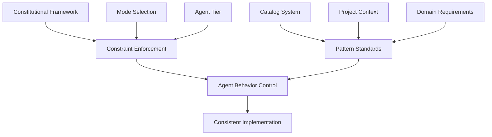
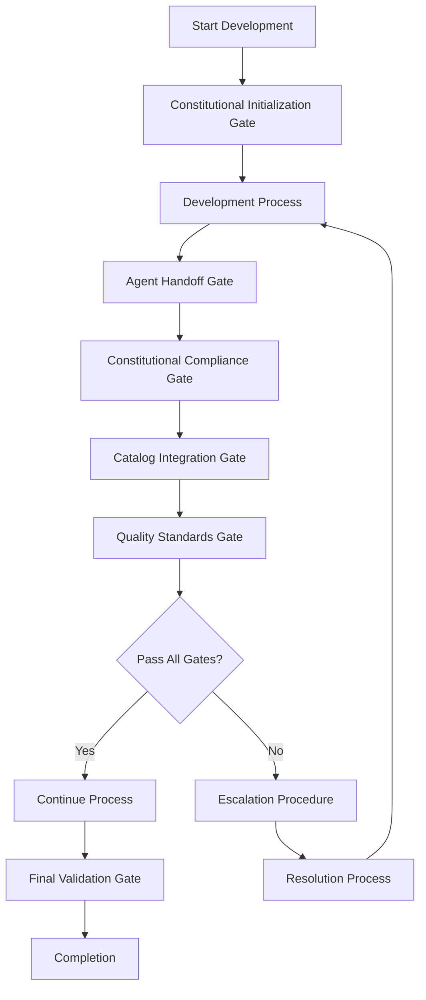
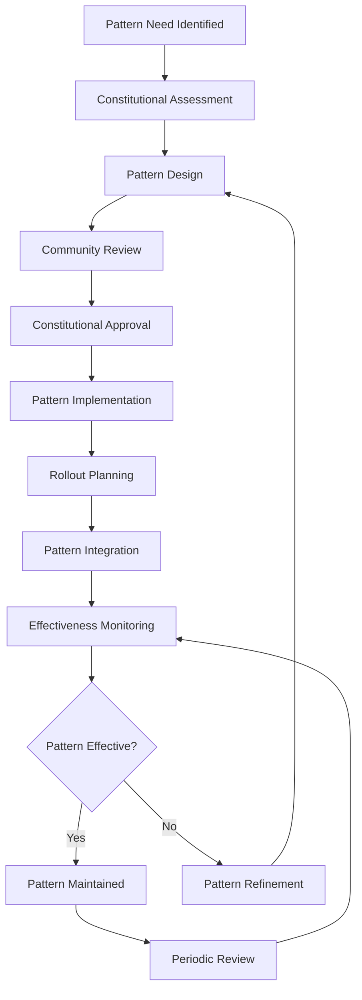

# SEAD Constitutional Framework Guide

**Version**: 1.3.3  
**Date**: 2025-01-15  
**Status**: Production Ready

## Table of Contents

1. [Introduction](#introduction)
2. [Constitutional Principles](#constitutional-principles)
3. [Constraint Tier System](#constraint-tier-system)
4. [Mode-Based Governance](#mode-based-governance)
5. [Catalog Integration](#catalog-integration)
6. [Agent-Specific Constraints](#agent-specific-constraints)
7. [Quality Gates & Validation](#quality-gates--validation)
8. [Escalation Procedures](#escalation-procedures)
9. [Pattern Evolution](#pattern-evolution)
10. [Implementation Guidelines](#implementation-guidelines)
11. [Troubleshooting](#troubleshooting)

---

## Introduction

The SEAD Constitutional Framework is the revolutionary governance system that prevents AI agent drift while maintaining development velocity. Unlike traditional development methodologies that rely on human oversight, SEAD embeds constitutional constraints directly into the AI agent behavior, ensuring consistent, high-quality outcomes across all development phases.

### Why Constitutional Constraints?

Traditional AI-assisted development faces several critical challenges:

- **🌪️ Agent Drift**: AI agents make inconsistent architectural decisions over time
- **📈 Complexity Creep**: Solutions become unnecessarily complex without proper constraints
- **🔀 Pattern Fragmentation**: Different approaches to similar problems across the same project
- **⚡ Context Loss**: Important architectural decisions get lost between agent handoffs
- **🎯 Quality Inconsistency**: Variable quality depending on agent "mood" or prompt variations

SEAD's Constitutional Framework solves these problems by:

- **🏛️ Embedding Governance**: Constitutional rules are built into every agent's behavior
- **📚 Enforcing Patterns**: All decisions must reference established catalog patterns
- **⚖️ Balancing Constraints**: Mode-appropriate governance from prototype to production
- **🔄 Preserving Context**: Information continuity through structured handoffs
- **🛡️ Anti-Drift Protection**: Automatic validation prevents architectural inconsistencies

---

## Constitutional Principles

The SEAD Constitution is built on seven core principles that govern all agent behavior:

### 1. 📚 Catalog Compliance

**Principle**: All architectural and implementation decisions must reference and align with established catalog patterns.

**Implementation**:
- Every decision must cite a specific catalog pattern
- Deviations require explicit justification and approval
- New patterns must follow catalog standards and review process
- Pattern usage is tracked and validated

**Example**:
```yaml
# Good: Constitutional compliance
decision: "REST API error handling"
catalog_reference: "/sead-catalog/error-handling/README.md#rest-error-patterns"
pattern_id: "ERR-001"
justification: "Aligns with established error response format"

# Bad: Constitutional violation  
decision: "Custom error handling"
rationale: "Seemed like a good idea"
# Missing: catalog_reference, pattern_id, constitutional_compliance
```

### 2. ⚖️ Mode-Appropriate Constraints

**Principle**: Constraint enforcement adapts to development mode (prototype/development/build-to-deploy) with progressive rigor.

**Implementation**:
- Prototype Mode: Minimal constraints, maximum flexibility
- Development Mode: Progressive constraints, balanced quality
- Build-to-Deploy Mode: Strict constraints, maximum reliability
- Mode transitions require validation and approval

**Constraint Scaling**:
```yaml
prototype_mode:
  complexity: minimal
  validation: basic
  documentation: optional
  testing: smoke_only

development_mode:
  complexity: progressive  
  validation: comprehensive
  documentation: required
  testing: unit_and_integration

build_to_deploy_mode:
  complexity: strict
  validation: full_compliance
  documentation: comprehensive
  testing: full_suite_required
```

### 3. 🛡️ Anti-Drift Protection

**Principle**: Systematic validation prevents architectural drift and pattern fragmentation.

**Implementation**:
- Consistency checks at every agent handoff
- Pattern usage validation against established standards
- Architecture coherence verification
- Technical debt accumulation monitoring

**Anti-Drift Mechanisms**:
- **Pattern Consistency**: All similar problems use the same catalog patterns
- **Architecture Coherence**: Design decisions align with overall system architecture  
- **Technology Stack Consistency**: Technology choices remain coherent across components
- **Code Quality Standards**: Consistent quality metrics and enforcement

### 4. 🔄 Quality Gates

**Principle**: Progressive validation checkpoints ensure quality at every stage.

**Implementation**:
- Constitutional compliance validation before agent handoffs
- Catalog pattern integration verification
- Quality metrics tracking and enforcement
- Automated and manual validation procedures

**Quality Gate Types**:
- **Constitutional Gates**: Validate constraint compliance
- **Catalog Gates**: Verify pattern usage and integration
- **Technical Gates**: Ensure code quality and functionality
- **Integration Gates**: Validate component interactions

### 5. 📋 Escalation Procedures

**Principle**: Clear pathways for handling constraint conflicts and exceptional situations.

**Implementation**:
- Defined escalation triggers and criteria
- Structured decision-making processes  
- Documentation requirements for all escalations
- Resolution tracking and learning integration

### 6. 📈 Pattern Evolution

**Principle**: Controlled advancement of catalog patterns based on project learnings.

**Implementation**:
- Pattern effectiveness tracking and measurement
- Community-driven pattern improvement
- Version-controlled pattern evolution
- Impact assessment for pattern changes

### 7. 🤝 Context Preservation

**Principle**: Critical information continuity across all agent handoffs and development phases.

**Implementation**:
- Structured handoff documentation requirements
- Constitutional compliance status tracking
- Decision rationale preservation
- Context validation at handoff points

---

## Constraint Tier System

SEAD employs a four-tier constraint system that applies different governance levels based on agent roles and drift risk:

### Tier 1: Full Constitutional Constraints (High Technical Drift Risk)

**Agents**: SEAD Developer, SEAD Architect, SEAD QA

**Risk Profile**: These agents make technical decisions that directly impact system architecture, code quality, and reliability. Drift here causes immediate technical problems.

**Constraint Level**: **STRICT** - Full constitutional compliance required

**Key Constraints**:
```yaml
tier_1_constraints:
  catalog_compliance: MANDATORY
  pattern_references: REQUIRED_WITH_TRACEABILITY
  anti_drift_validation: COMPREHENSIVE
  quality_gates: ALL_GATES_REQUIRED
  escalation_procedures: IMMEDIATE_FOR_VIOLATIONS
  context_preservation: DETAILED_HANDOFF_REQUIRED
  mode_constraints: STRICTLY_ENFORCED
```

**Example Constraint Application**:
```yaml
# SEAD Developer Constraints (Tier 1)
sead_developer_constraints:
  mandatory_reads:
    - "/sead-catalog/api-contracts/README.md"
    - "/sead-catalog/error-handling/README.md" 
    - "/sead-catalog/shared-types/README.md"
  
  blocking_violations:
    - "No catalog pattern reference in implementation"
    - "Complexity exceeds mode-appropriate limits"
    - "Quality gates failed without escalation"
  
  validation_requirements:
    - constitutional_compliance_check: BEFORE_HANDOFF
    - catalog_pattern_verification: EVERY_DECISION
    - anti_drift_validation: CONTINUOUS
```

### Tier 2: Catalog-Aware Constraints (Medium Drift Risk)

**Agents**: SEAD Scrum Master, SEAD Product Owner, SEAD UX Expert, SEAD Catalog Architect

**Risk Profile**: These agents make process and planning decisions that affect project consistency and user experience. Drift creates coordination problems and inconsistent outcomes.

**Constraint Level**: **PROGRESSIVE** - Catalog awareness with flexible enforcement

**Key Constraints**:
```yaml
tier_2_constraints:
  catalog_awareness: REQUIRED
  pattern_consistency: ENCOURAGED_WITH_VALIDATION
  process_standardization: ENFORCED
  quality_coordination: REQUIRED
  escalation_procedures: STRUCTURED_APPROVAL
  context_handoffs: STANDARDIZED_FORMAT
  mode_sensitivity: ADAPTIVE_ENFORCEMENT
```

### Tier 3: Guidance Frameworks (Low Drift Risk)

**Agents**: SEAD Analyst, SEAD Project Manager, SEAD Pattern Extraction

**Risk Profile**: These agents provide analysis and support functions. Drift affects efficiency and coordination but doesn't directly impact technical outcomes.

**Constraint Level**: **GUIDANCE** - Best practice frameworks with optional enforcement

**Key Constraints**:
```yaml
tier_3_constraints:
  best_practice_guidance: PROVIDED
  methodology_consistency: ENCOURAGED
  reporting_standards: REQUIRED
  coordination_support: STRUCTURED
  escalation_support: ADVISORY_ROLE
  context_contribution: STANDARDIZED
  mode_awareness: INFORMATIONAL
```

### Tier 4: Aggregate Agent Frameworks (Master & Orchestrator)

**Agents**: SEAD Master, SEAD Orchestrator

**Risk Profile**: These agents coordinate other agents and inherit all their constraints. They ensure system-wide consistency and constitutional compliance.

**Constraint Level**: **AGGREGATE** - Inherit and coordinate all other tiers

**Key Constraints**:
```yaml
tier_4_constraints:
  constraint_inheritance: ALL_SUBORDINATE_TIERS
  coordination_validation: COMPREHENSIVE
  system_consistency: ENFORCED
  constitutional_oversight: FULL_AUTHORITY
  escalation_management: FINAL_AUTHORITY
  context_orchestration: SYSTEM_WIDE
  mode_management: AUTHORITATIVE
```

---

## Mode-Based Governance

### 🧪 Prototype Mode: Minimal Constraints, Maximum Velocity

**Purpose**: Rapid experimentation, concept validation, early-stage development

**Philosophy**: Enable fast iteration and exploration while maintaining basic quality standards.

#### Constitutional Configuration
```yaml
prototype_mode:
  constraint_level: minimal
  validation_frequency: basic
  quality_gates: essential_only
  documentation_requirements: lightweight
  testing_requirements: smoke_tests
  catalog_compliance: encouraged
  
  # Agent-specific adjustments
  tier_1_agents:
    complexity_limits: relaxed
    pattern_enforcement: advisory
    validation_gates: reduced
    
  tier_2_agents:
    process_rigor: streamlined
    coordination_overhead: minimized
    
  escalation_thresholds:
    technical_violations: high_tolerance
    process_violations: advisory_only
```

#### When to Use Prototype Mode
- Early MVP development
- Proof of concept projects
- Rapid experimentation phases
- Learning and exploration projects
- Time-critical demonstrations

#### Prototype Mode Best Practices
- Focus on core functionality over perfect architecture
- Use catalog patterns as guidance, not strict requirements
- Document major architectural decisions for future evolution
- Plan migration path to development mode
- Maintain basic quality gates to prevent technical debt accumulation

### 🔧 Development Mode: Progressive Constraints, Balanced Quality

**Purpose**: Feature development, team collaboration, production preparation

**Philosophy**: Balance development velocity with quality assurance and maintainability.

#### Constitutional Configuration
```yaml
development_mode:
  constraint_level: progressive
  validation_frequency: comprehensive
  quality_gates: standard_set
  documentation_requirements: thorough
  testing_requirements: unit_and_integration
  catalog_compliance: enforced
  
  # Agent-specific adjustments
  tier_1_agents:
    complexity_limits: moderate
    pattern_enforcement: required
    validation_gates: standard
    
  tier_2_agents:
    process_rigor: structured
    coordination_overhead: balanced
    
  escalation_thresholds:
    technical_violations: moderate_tolerance
    process_violations: structured_resolution
```

#### When to Use Development Mode
- Feature development phases
- Team collaboration projects
- Pre-production development
- Client delivery projects
- Long-term maintenance projects

#### Development Mode Best Practices
- Enforce catalog pattern compliance consistently
- Maintain comprehensive testing and documentation
- Use structured agent handoffs and context preservation
- Implement progressive quality gates
- Plan architecture for production scalability

### 🚀 Build-to-Deploy Mode: Strict Constraints, Maximum Reliability

**Purpose**: Production systems, enterprise applications, mission-critical software

**Philosophy**: Prioritize reliability, maintainability, and long-term stability over development speed.

#### Constitutional Configuration
```yaml
build_to_deploy_mode:
  constraint_level: strict
  validation_frequency: continuous
  quality_gates: comprehensive_set
  documentation_requirements: complete
  testing_requirements: full_suite
  catalog_compliance: mandatory
  
  # Agent-specific adjustments
  tier_1_agents:
    complexity_limits: strict
    pattern_enforcement: mandatory
    validation_gates: comprehensive
    
  tier_2_agents:
    process_rigor: formal
    coordination_overhead: comprehensive
    
  escalation_thresholds:
    technical_violations: zero_tolerance
    process_violations: formal_review_required
```

#### When to Use Build-to-Deploy Mode
- Production system development
- Enterprise software projects
- Mission-critical applications
- Regulatory compliance projects
- High-stakes client deliveries

#### Build-to-Deploy Mode Best Practices
- Enforce strict catalog pattern compliance
- Implement comprehensive testing at all levels
- Require formal documentation and architectural reviews
- Use detailed agent handoffs with full context preservation
- Implement comprehensive quality gates and validation procedures

---

## Catalog Integration

### Understanding Catalog-Constitutional Alignment

The catalog system and constitutional framework work together to ensure consistent, high-quality development:



### Catalog Domain Integration

Each catalog domain has specific constitutional integration requirements:

#### 🔗 API Contracts & Constitutional Compliance
```yaml
api_contracts_integration:
  constitutional_requirements:
    - pattern_reference_mandatory: true
    - version_consistency_required: true
    - error_handling_alignment: required
    - authentication_integration: enforced
  
  validation_gates:
    - api_pattern_compliance
    - contract_consistency_check
    - integration_point_validation
```

#### 📊 Shared Types & Type Safety
```yaml
shared_types_integration:
  constitutional_requirements:
    - type_consistency_across_domains: enforced
    - validation_schema_alignment: required
    - evolution_compatibility: maintained
  
  anti_drift_protection:
    - type_definition_consistency
    - cross_domain_type_validation
    - breaking_change_prevention
```

#### 🎨 Design System & UI Consistency
```yaml
design_system_integration:
  constitutional_requirements:
    - component_pattern_compliance: enforced
    - accessibility_standards_required: true
    - responsive_design_alignment: required
  
  quality_gates:
    - design_consistency_validation
    - accessibility_compliance_check
    - cross_platform_compatibility
```

### Catalog Pattern Evolution Process

Constitutional constraints govern how catalog patterns evolve:

#### Pattern Proposal Process
1. **Need Identification**: Document why new pattern is needed
2. **Constitutional Review**: Ensure pattern aligns with constitutional principles
3. **Integration Assessment**: Evaluate impact on existing patterns
4. **Community Review**: Stakeholder feedback and validation
5. **Constitutional Approval**: Formal approval through governance process
6. **Pattern Implementation**: Integration into catalog with versioning
7. **Rollout Planning**: Controlled deployment across projects

#### Pattern Evolution Constraints
```yaml
pattern_evolution_constraints:
  backwards_compatibility: required_unless_major_version
  integration_impact_assessment: mandatory
  constitutional_alignment_review: required
  community_feedback_period: 14_days_minimum
  formal_approval_required: constitutional_review_board
  versioning_strategy: semantic_versioning_required
  migration_path_documentation: mandatory
```

---

## Agent-Specific Constraints

### Tier 1 Agents: Full Constitutional Compliance

#### SEAD Developer Constraints

**Primary Responsibility**: Code implementation with constitutional compliance

```yaml
sead_developer_constraints:
  mandatory_catalog_reads:
    - "/sead-catalog/api-contracts/README.md"
    - "/sead-catalog/shared-types/README.md"
    - "/sead-catalog/error-handling/README.md"
    - "/sead-catalog/validation-schemas/README.md"
    
  blocking_violations:
    - no_catalog_pattern_reference
    - complexity_exceeds_mode_limits
    - quality_gates_failed
    - anti_drift_validation_failed
    
  validation_requirements:
    constitutional_compliance_check: before_handoff
    catalog_pattern_verification: every_implementation
    code_quality_validation: continuous
    testing_compliance: comprehensive
    
  escalation_triggers:
    - constraint_conflict_with_requirements
    - catalog_pattern_insufficient_for_use_case
    - quality_gate_failure_with_business_impact
```

#### SEAD Architect Constraints

**Primary Responsibility**: System architecture with constitutional validation

```yaml
sead_architect_constraints:
  mandatory_catalog_reads:
    - "/sead-catalog/integration-patterns/README.md"
    - "/sead-catalog/deployment-strategy/README.md"
    - "/sead-catalog/data-strategy/README.md"
    - "/sead-catalog/api-contracts/README.md"
    
  blocking_violations:
    - architecture_violates_catalog_patterns
    - complexity_inappropriate_for_mode
    - integration_patterns_inconsistent
    - scalability_requirements_not_addressed
    
  validation_requirements:
    architectural_coherence_check: comprehensive
    catalog_integration_validation: all_domains
    scalability_assessment: required
    constitutional_compliance_review: before_handoff
```

#### SEAD QA Constraints

**Primary Responsibility**: Quality assurance with constitutional validation

```yaml
sead_qa_constraints:
  mandatory_catalog_reads:
    - "/sead-catalog/test-patterns/README.md"
    - "/sead-catalog/error-handling/README.md"
    - "/sead-catalog/validation-schemas/README.md"
    
  blocking_violations:
    - test_coverage_below_mode_requirements
    - constitutional_violations_not_addressed
    - catalog_pattern_compliance_not_validated
    
  validation_requirements:
    constitutional_compliance_testing: comprehensive
    catalog_pattern_validation: all_used_patterns
    quality_gate_enforcement: strict
    regression_testing: for_all_changes
```

### Tier 2 Agents: Catalog-Aware Constraints

#### SEAD Product Owner Constraints

**Primary Responsibility**: Project validation with catalog awareness

```yaml
sead_product_owner_constraints:
  catalog_awareness_requirements:
    - understand_available_patterns
    - align_requirements_with_catalog_capabilities
    - plan_pattern_evolution_needs
    
  process_constraints:
    - requirements_must_reference_catalog_patterns
    - user_stories_include_constitutional_context
    - acceptance_criteria_include_compliance_validation
    
  coordination_requirements:
    - agent_handoffs_preserve_constitutional_context
    - quality_gates_aligned_with_mode_constraints
    - escalation_procedures_followed_for_conflicts
```

### Tier 3 Agents: Guidance Frameworks

#### SEAD Analyst Constraints

**Primary Responsibility**: Requirements analysis with constitutional awareness

```yaml
sead_analyst_constraints:
  guidance_frameworks:
    - research_methodologies_aligned_with_constitutional_principles
    - analysis_outputs_support_catalog_pattern_decisions
    - requirements_gathering_includes_constitutional_considerations
    
  reporting_requirements:
    - constitutional_impact_assessment_in_research
    - catalog_pattern_recommendations_in_analysis
    - mode_appropriate_complexity_assessment
    
  coordination_support:
    - provide_constitutional_context_to_other_agents
    - support_escalation_procedures_with_analysis
    - contribute_to_pattern_evolution_research
```

---

## Quality Gates & Validation

### Constitutional Quality Gate Framework

Quality gates are validation checkpoints that ensure constitutional compliance at critical points in the development process:



### Gate Types and Requirements

#### 1. Constitutional Initialization Gate

**Purpose**: Ensure proper constitutional setup before development begins

**Validation Criteria**:
```yaml
constitutional_initialization_gate:
  required_checks:
    - constitutional_rules_loaded
    - catalog_patterns_accessible
    - mode_constraints_understood
    - agent_coordination_plan_established
    
  success_criteria:
    - all_required_constitutional_files_readable
    - catalog_domains_validated_for_project
    - development_mode_appropriately_selected
    - escalation_procedures_understood
    
  failure_responses:
    - block_development_until_resolved
    - escalate_to_constitutional_review_board
    - provide_detailed_remediation_guidance
```

#### 2. Agent Handoff Gate

**Purpose**: Validate constitutional compliance during agent transitions

**Validation Criteria**:
```yaml
agent_handoff_gate:
  handoff_requirements:
    - constitutional_compliance_status_documented
    - catalog_patterns_used_listed_with_references
    - context_preservation_requirements_met
    - quality_metrics_provided
    
  validation_checks:
    - anti_drift_validation_passed
    - catalog_integration_verified
    - constitutional_violations_addressed
    - escalation_issues_resolved_or_documented
    
  quality_standards:
    - documentation_completeness_validated
    - pattern_consistency_verified
    - mode_appropriate_complexity_confirmed
```

#### 3. Catalog Integration Gate

**Purpose**: Ensure proper catalog pattern usage and integration

**Validation Criteria**:
```yaml
catalog_integration_gate:
  pattern_usage_validation:
    - all_decisions_reference_catalog_patterns
    - pattern_integration_consistency_verified
    - cross_domain_pattern_alignment_confirmed
    
  evolution_assessment:
    - new_pattern_needs_identified
    - existing_pattern_effectiveness_evaluated
    - pattern_evolution_recommendations_documented
    
  compliance_verification:
    - pattern_reference_traceability_complete
    - constitutional_alignment_confirmed
    - integration_impact_assessed
```

#### 4. Quality Standards Gate

**Purpose**: Enforce mode-appropriate quality standards

**Validation Criteria**:
```yaml
quality_standards_gate:
  mode_specific_requirements:
    prototype_mode:
      - basic_functionality_validated
      - core_user_flows_working
      - major_architectural_decisions_documented
      
    development_mode:
      - comprehensive_testing_completed
      - code_quality_standards_met
      - documentation_requirements_satisfied
      - integration_testing_passed
      
    build_to_deploy_mode:
      - full_test_suite_passing
      - security_review_completed
      - performance_requirements_met
      - production_readiness_validated
```

### Automated vs Manual Validation

#### Automated Validation
```yaml
automated_validation:
  constitutional_compliance:
    - catalog_reference_checker
    - pattern_consistency_validator
    - anti_drift_detection_system
    
  code_quality:
    - linting_with_constitutional_rules
    - automated_testing_pipeline
    - security_scanning_integration
    
  integration:
    - cross_domain_pattern_validation
    - api_contract_compliance_checking
    - type_safety_verification
```

#### Manual Validation
```yaml
manual_validation:
  constitutional_review:
    - architectural_decision_review
    - pattern_evolution_assessment
    - escalation_resolution_validation
    
  quality_assessment:
    - user_experience_validation
    - business_requirement_alignment
    - stakeholder_acceptance_criteria
    
  coordination_review:
    - agent_handoff_effectiveness
    - context_preservation_quality
    - process_improvement_opportunities
```

---

## Escalation Procedures

### When to Escalate

Constitutional escalation is required when:

1. **Constraint Conflicts**: Constitutional constraints conflict with business requirements
2. **Pattern Insufficiency**: No existing catalog pattern adequately addresses the need
3. **Quality Gate Failures**: Repeated failures with significant business impact
4. **Agent Coordination Issues**: Constitutional framework prevents effective agent coordination
5. **Mode Transition Needs**: Project requires different constitutional constraints than current mode
6. **Emergency Situations**: Time-critical decisions that may require constraint relaxation

### Escalation Levels

#### Level 1: Agent-Level Resolution

**Scope**: Minor constraint interpretations, pattern selection guidance

**Process**:
1. Document the specific constraint issue
2. Research alternative constitutional approaches
3. Consult catalog patterns for guidance
4. Make decision within constitutional bounds
5. Document resolution and rationale

**Timeline**: Immediate to 4 hours

**Example**:
```yaml
level_1_escalation:
  issue: "Two catalog patterns provide similar but different approaches"
  pattern_a: "/sead-catalog/api-contracts/REST-patterns"
  pattern_b: "/sead-catalog/integration-patterns/GraphQL-patterns"
  resolution: "Selected REST pattern based on existing system architecture"
  rationale: "Maintains consistency with established API architecture"
  constitutional_compliance: "Pattern selection aligns with consistency principle"
```

#### Level 2: Project-Level Review

**Scope**: Significant constraint conflicts, pattern evolution needs, mode transitions

**Process**:
1. Formal escalation documentation
2. Impact assessment on project and constitutional framework
3. Stakeholder review and consultation
4. Constitutional review board assessment
5. Formal decision with documentation
6. Implementation planning and communication

**Timeline**: 1-3 business days

**Participants**: Project lead, constitutional review board, affected agents

#### Level 3: Constitutional Framework Review

**Scope**: Framework modifications, new constitutional principles, systemic issues

**Process**:
1. Comprehensive impact assessment
2. Community consultation and feedback
3. Constitutional framework analysis
4. Formal governance review
5. Framework modification proposal
6. Implementation and rollout planning

**Timeline**: 1-4 weeks

**Participants**: Constitutional governance board, community representatives, framework architects

### Escalation Documentation Requirements

#### Level 1 Documentation
```yaml
level_1_escalation:
  timestamp: "2025-01-05T10:30:00Z"
  agent: "sead-developer"
  project: "e-commerce-platform"
  issue_type: "pattern_selection_conflict"
  
  problem_description: |
    Multiple catalog patterns available for user authentication.
    Auth-001 (JWT) vs Auth-002 (Session-based).
    
  constitutional_context:
    relevant_principles:
      - catalog_compliance
      - pattern_consistency
    current_mode: development
    constraint_tier: tier_1
    
  resolution:
    selected_approach: "Auth-001 (JWT)"
    rationale: "Aligns with existing API stateless architecture"
    constitutional_compliance: "Maintains architectural consistency principle"
    
  validation:
    quality_gates_passed: true
    anti_drift_check: passed
    catalog_integration: validated
```

#### Level 2 Documentation
```yaml
level_2_escalation:
  escalation_id: "ESC-2025-001"
  timestamp: "2025-01-05T14:00:00Z"
  escalator: "sead-architect"
  project: "enterprise-banking-system"
  severity: "high"
  
  issue_description: |
    Constitutional constraints prevent implementation of required 
    regulatory compliance feature. Strict mode constraints conflict 
    with mandated legacy system integration requirements.
    
  constitutional_impact:
    affected_principles:
      - catalog_compliance
      - anti_drift_protection
      - mode_appropriate_constraints
    constraint_conflicts:
      - catalog_patterns_insufficient_for_legacy_integration
      - complexity_exceeds_build_to_deploy_mode_limits
      
  business_impact:
    timeline_risk: "2 weeks delay without resolution"
    compliance_risk: "Regulatory non-compliance if not addressed"
    quality_risk: "Potential technical debt accumulation"
    
  proposed_solutions:
    solution_1:
      description: "Create new catalog pattern for legacy integration"
      constitutional_impact: "Pattern evolution process required"
      timeline: "1 week for pattern development and review"
      
    solution_2:
      description: "Temporary constraint relaxation with remediation plan"
      constitutional_impact: "Requires formal exception approval"
      timeline: "Immediate implementation, 4 week remediation plan"
      
  review_board_decision:
    decision: "Approved temporary constraint relaxation"
    conditions:
      - formal_remediation_plan_required
      - pattern_evolution_initiated_in_parallel
      - additional_quality_gates_implemented
    review_date: "2025-01-08"
    next_review: "2025-01-15"
```

---

## Pattern Evolution

### Constitutional Pattern Evolution Framework

The SEAD constitutional framework governs how catalog patterns evolve to ensure they remain effective while maintaining constitutional compliance:



### Pattern Evolution Triggers

#### 1. Inadequate Pattern Coverage
```yaml
pattern_gap_identification:
  trigger_conditions:
    - no_existing_pattern_addresses_need
    - existing_patterns_insufficient_for_requirements
    - constitutional_principles_require_new_approach
    
  assessment_criteria:
    - business_impact_assessment
    - technical_complexity_evaluation
    - constitutional_alignment_review
    - integration_impact_analysis
```

#### 2. Pattern Effectiveness Issues
```yaml
pattern_effectiveness_review:
  monitoring_metrics:
    - pattern_usage_frequency
    - implementation_success_rate
    - developer_satisfaction_scores
    - quality_outcome_correlation
    
  improvement_triggers:
    - usage_frequency_below_threshold
    - implementation_failure_rate_high
    - consistent_developer_feedback_issues
    - quality_correlation_negative
```

#### 3. Constitutional Alignment Updates
```yaml
constitutional_alignment_review:
  review_triggers:
    - constitutional_framework_updates
    - mode_constraint_modifications
    - quality_gate_requirement_changes
    - anti_drift_mechanism_improvements
    
  alignment_assessment:
    - principle_compatibility_check
    - constraint_integration_validation
    - quality_gate_alignment_verification
```

### Pattern Evolution Process

#### Phase 1: Need Assessment and Constitutional Review
```yaml
phase_1_assessment:
  activities:
    - document_pattern_need_clearly
    - assess_constitutional_impact
    - evaluate_existing_pattern_gaps
    - determine_evolution_vs_new_pattern
    
  deliverables:
    - pattern_need_documentation
    - constitutional_impact_assessment
    - gap_analysis_report
    - evolution_recommendation
    
  approval_criteria:
    - constitutional_alignment_confirmed
    - business_justification_validated
    - technical_feasibility_assessed
    - community_need_verified
```

#### Phase 2: Pattern Design and Validation
```yaml
phase_2_design:
  activities:
    - design_pattern_with_constitutional_compliance
    - create_implementation_examples
    - develop_integration_guidelines
    - establish_validation_criteria
    
  constitutional_requirements:
    - pattern_must_align_with_all_seven_principles
    - integration_with_existing_patterns_validated
    - mode_appropriate_complexity_levels_defined
    - anti_drift_protection_mechanisms_included
    
  validation_process:
    - pattern_consistency_check
    - integration_impact_assessment
    - implementation_feasibility_testing
    - constitutional_compliance_verification
```

#### Phase 3: Community Review and Feedback
```yaml
phase_3_community_review:
  review_process:
    - pattern_published_for_community_feedback
    - structured_feedback_collection
    - expert_review_panel_assessment
    - implementation_pilot_projects
    
  feedback_integration:
    - constitutional_compliance_feedback_addressed
    - technical_implementation_feedback_incorporated
    - usability_improvements_implemented
    - integration_concerns_resolved
    
  approval_criteria:
    - community_consensus_achieved
    - expert_panel_approval_received
    - pilot_project_success_validated
    - constitutional_compliance_verified
```

#### Phase 4: Constitutional Approval and Integration
```yaml
phase_4_approval:
  approval_process:
    - constitutional_review_board_assessment
    - formal_approval_decision
    - integration_planning_development
    - rollout_strategy_creation
    
  integration_requirements:
    - catalog_structure_updated
    - cross_pattern_references_established
    - documentation_comprehensive_and_complete
    - validation_tools_updated
    
  rollout_planning:
    - phased_deployment_strategy
    - training_material_development
    - migration_guidance_creation
    - support_process_establishment
```

---

## Implementation Guidelines

### For Development Teams

#### Getting Started with Constitutional Development

1. **Initialize Constitutional Environment**
   ```bash
   # Ensure constitutional files are loaded and accessible
   sead init my-project --mode development --constitutional-compliance
   
   # Verify constitutional setup
   sead validate --constitutional-setup
   ```

2. **Read Your Agent's Constitutional Constraints**
   ```bash
   # Read your specific agent constraints
   cat sead-core/constitutional-rules/sead-developer-constraints.yaml
   
   # Understand catalog integration requirements
   ls sead-catalog/*/README.md
   ```

3. **Follow Constitutional Development Workflow**
   ```bash
   # Each command respects constitutional constraints
   sead specify "Feature description" --mode development
   sead plan fullstack --constitutional-compliance
   sead stories --enforce-catalog --constitutional-validation
   sead implement story-001 --validate-compliance
   ```

#### Constitutional Development Best Practices

1. **Always Read Constraints First**: Before starting any work, understand your constitutional obligations
2. **Reference Catalog Patterns**: Every technical decision should reference appropriate catalog patterns
3. **Document Deviations**: Any deviation from catalog patterns requires explicit justification
4. **Use Quality Gates**: Leverage constitutional quality gates to maintain standards
5. **Escalate Appropriately**: Don't bypass constraints—use proper escalation procedures

#### Working with Constitutional Quality Gates

```yaml
quality_gate_integration:
  pre_development:
    - verify_constitutional_setup
    - validate_catalog_access
    - confirm_mode_appropriateness
    
  during_development:
    - continuous_catalog_compliance_checking
    - regular_anti_drift_validation
    - progressive_quality_gate_validation
    
  pre_handoff:
    - comprehensive_constitutional_compliance_check
    - catalog_integration_validation
    - context_preservation_preparation
    
  post_handoff:
    - handoff_effectiveness_validation
    - context_preservation_verification
    - constitutional_continuity_confirmation
```

### For Project Managers

#### Constitutional Project Setup

1. **Select Appropriate Development Mode**
   - Assess project requirements and constraints
   - Choose mode based on quality, timeline, and risk requirements
   - Plan mode transitions as project evolves

2. **Establish Constitutional Governance**
   - Set up constitutional review processes
   - Define escalation procedures and authority
   - Establish quality gate validation procedures

3. **Plan Agent Coordination**
   - Define agent handoff procedures
   - Establish context preservation requirements
   - Plan constitutional compliance validation checkpoints

#### Managing Constitutional Compliance

```yaml
project_management_constitutional_integration:
  planning_phase:
    - constitutional_requirements_integrated_into_project_plan
    - quality_gates_scheduled_appropriately
    - escalation_procedures_established
    
  execution_phase:
    - constitutional_compliance_monitoring_continuous
    - agent_coordination_effectiveness_tracked
    - quality_gate_success_rates_measured
    
  review_phase:
    - constitutional_framework_effectiveness_assessed
    - pattern_evolution_needs_identified
    - process_improvement_opportunities_documented
```

### For Architects

#### Constitutional Architecture Design

1. **Align with Catalog Patterns**
   - Start with existing catalog patterns as foundation
   - Justify any deviations with clear rationale
   - Plan pattern evolution for new requirements

2. **Design for Constitutional Compliance**
   - Build anti-drift protection into architecture
   - Design quality gates and validation points
   - Plan for mode-appropriate complexity scaling

3. **Enable Agent Coordination**
   - Design clear component boundaries for agent handoffs
   - Establish architectural decision documentation requirements
   - Plan context preservation mechanisms

---

## Troubleshooting

### Common Constitutional Issues

#### Issue: Constitutional Constraint Violation

**Symptoms**:
- Agent reports constraint violation
- Quality gates failing
- Development blocked by constitutional rules

**Diagnosis**:
```bash
# Check constraint status
sead validate --constitutional --detailed

# Review specific constraint files
cat sead-core/constitutional-rules/sead-[agent]-constraints.yaml

# Verify catalog pattern compliance
sead catalog validate --constitutional-compliance
```

**Resolution**:
1. Understand the specific constraint being violated
2. Review catalog patterns for compliant approaches
3. Adjust implementation to align with constraints
4. If necessary, use appropriate escalation procedures
5. Document resolution for future reference

#### Issue: Catalog Pattern Conflicts

**Symptoms**:
- Multiple patterns suggest different approaches
- Uncertainty about which pattern to use
- Integration challenges between patterns

**Diagnosis**:
```bash
# Review conflicting patterns
cat sead-catalog/domain1/README.md
cat sead-catalog/domain2/README.md

# Check pattern integration guidance
sead catalog validate --integration-validation
```

**Resolution**:
1. Review both patterns thoroughly
2. Consider project context and requirements
3. Check for pattern integration guidance
4. Make decision based on constitutional principles
5. Document decision with clear rationale
6. Consider escalating for pattern evolution if needed

#### Issue: Agent Coordination Breakdown

**Symptoms**:
- Context lost between agent handoffs
- Inconsistent architectural decisions
- Quality gate failures at handoff points

**Diagnosis**:
```bash
# Review handoff documentation
ls sead-workspace/implementations/
cat sead-workspace/implementations/latest-impl.md

# Check agent coordination status
sead status --agent-status --detailed
```

**Resolution**:
1. Review previous agent's handoff documentation
2. Validate constitutional compliance status
3. Check catalog pattern consistency
4. Re-establish context through documentation review
5. Improve handoff procedures for future coordination

### Constitutional Framework Maintenance

#### Regular Maintenance Tasks

```yaml
constitutional_maintenance:
  daily:
    - monitor_quality_gate_success_rates
    - track_constitutional_compliance_metrics
    - review_escalation_requests
    
  weekly:
    - analyze_pattern_usage_effectiveness
    - review_agent_coordination_success
    - assess_anti_drift_protection_effectiveness
    
  monthly:
    - comprehensive_constitutional_framework_review
    - pattern_evolution_needs_assessment
    - process_improvement_opportunity_identification
    
  quarterly:
    - constitutional_framework_effectiveness_analysis
    - community_feedback_integration
    - framework_evolution_planning
```

#### Performance Monitoring

```yaml
constitutional_performance_metrics:
  compliance_metrics:
    - constraint_violation_frequency
    - quality_gate_success_rates
    - escalation_resolution_effectiveness
    
  efficiency_metrics:
    - development_velocity_impact
    - agent_coordination_effectiveness
    - context_preservation_success_rates
    
  quality_metrics:
    - architectural_consistency_improvements
    - technical_debt_reduction
    - pattern_usage_effectiveness
```

---

## Conclusion

The SEAD Constitutional Framework represents a revolutionary approach to AI-assisted software development governance. By embedding constitutional constraints directly into AI agent behavior, SEAD ensures consistent, high-quality development outcomes while maintaining development velocity.

### Key Benefits Realized

1. **🛡️ Drift Prevention**: Constitutional constraints prevent AI agents from making inconsistent decisions
2. **📚 Pattern Consistency**: Catalog integration ensures all projects use validated, consistent patterns
3. **⚖️ Balanced Governance**: Mode-appropriate constraints balance quality with development speed
4. **🔄 Quality Assurance**: Progressive quality gates ensure standards are maintained throughout development
5. **🤝 Agent Coordination**: Structured handoffs preserve context and maintain project coherence
6. **📈 Continuous Improvement**: Pattern evolution ensures the framework adapts and improves over time

### Implementation Success Factors

- **Constitutional Commitment**: Teams must embrace constitutional constraints as enablers, not impediments
- **Catalog Investment**: Building and maintaining high-quality catalog patterns is essential
- **Process Integration**: Constitutional framework must be integrated into all development processes
- **Training and Support**: Teams need proper training on constitutional principles and procedures
- **Continuous Monitoring**: Regular assessment and improvement of constitutional effectiveness

### Future Evolution

The SEAD Constitutional Framework is designed for evolution:

- **Community-Driven**: Pattern evolution driven by community needs and feedback
- **Data-Informed**: Metrics and analytics drive framework improvements
- **Adaptive**: Framework adapts to new technologies and development practices
- **Extensible**: Organizations can extend and customize for specific needs

By following the guidelines in this document and embracing the constitutional approach to AI-assisted development, teams can achieve unprecedented consistency, quality, and velocity in their software development efforts.

---

**Document Version**: 1.0  
**Last Updated**: 2025-01-05  
**SEAD-METHOD™ Version**: 1.0  
**Status**: Production Ready

For questions, contributions, or support, visit our [GitHub repository](https://github.com/CodifiedIntuition/SEAD-METHOD) or join our community discussions.