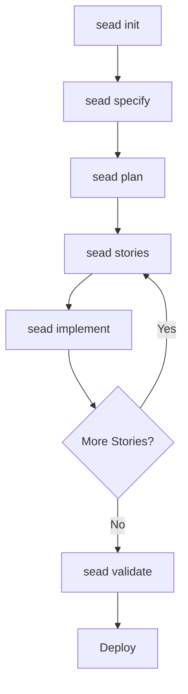

# SEAD-METHOD™ User Guide

**Version**: 1.0  
**Date**: 2025-01-05  
**Status**: Production Ready

## Table of Contents

1. [Introduction](#introduction)
2. [Getting Started](#getting-started)
3. [IDE Integration](#ide-integration)
4. [Core Concepts](#core-concepts)
5. [Development Workflow](#development-workflow)
6. [Constitutional Framework](#constitutional-framework)
7. [Catalog System](#catalog-system)
8. [CLI Commands](#cli-commands)
9. [Best Practices](#best-practices)
10. [Troubleshooting](#troubleshooting)
11. [Advanced Usage](#advanced-usage)

---

## Introduction

SEAD-METHOD™ (Specification Enforced Agentic Agile Development) is a revolutionary development methodology that combines the power of AI agents with constitutional constraints and catalog-based patterns to deliver consistent, high-quality software development at scale.

### What Makes SEAD Different?

- **🏛️ Constitutional Compliance**: Built-in constraints prevent AI agent drift and maintain code quality
- **📚 Catalog-Based Patterns**: Reusable, validated patterns ensure consistency across projects
- **🤖 AI Agent Coordination**: 12 specialized agents work together seamlessly
- **⚡ Mode-Adaptive**: Scales from rapid prototyping to production-grade development
- **🔄 End-to-End Workflow**: Complete development lifecycle from specification to deployment

### Key Benefits

- **Consistency**: Catalog patterns eliminate architectural drift
- **Quality**: Constitutional constraints enforce best practices
- **Speed**: AI agents accelerate development while maintaining standards
- **Scalability**: Works for individuals, teams, and enterprise organizations
- **Maintainability**: Clear patterns and documentation reduce technical debt

---

## Getting Started

### Prerequisites

- Node.js 16+ installed
- Git repository access  
- IDE of choice (Claude Code, Cursor, VS Code, etc.)
- Basic understanding of software development concepts

### Installation

#### Step 1: Package Installation
```bash
# Install SEAD-METHOD globally
npm install -g sead-method-core

# Verify installation
sead --version
```

#### Step 2: Professional IDE Integration
SEAD features a **BMAD-style professional installer** that automatically integrates with your IDE:

```bash
# Interactive installation (recommended)
sead install

# The installer will:
# 1. Detect/ask for your IDE preference
# 2. Install SEAD agents as IDE commands
# 3. Set up constitutional framework
# 4. Create .sead-core/ directory with all resources
```

#### Step 3: Verify IDE Integration
```bash
# Check installation status
sead status

# List available agents
sead list-agents

# Test in your IDE:
# Claude Code: /sead-architect "help me get started"  
# Cursor: @sead-architect "help me get started"
```

#### Step 4: Initialize Your Project
```bash
# Create new SEAD project
sead init my-project
cd my-project

# Your IDE now has access to all SEAD agents and workflows!
```

### Your First SEAD Project

1. **Initialize Project Structure**:
   ```bash
   sead init my-app --mode prototype
   ```

2. **Generate Project Specification**:
   ```bash
   sead specify "User authentication system" --mode prototype
   ```

3. **Create Development Plan**:
   ```bash
   sead plan fullstack --catalog-mode development
   ```

4. **Generate Stories**:
   ```bash
   sead stories --enforce-catalog --context-preserve
   ```

5. **Implement First Story**:
   ```bash
   sead implement story-001 --mode prototype
   ```

---

## IDE Integration

SEAD provides **professional-grade IDE integration** using the same system as BMAD-METHOD, supporting **15+ popular development environments**.

### Supported IDEs

| IDE | Command Format | Integration Method | Status |
|-----|---------------|-------------------|---------|
| **Claude Code** | `/sead-architect` | Slash commands | ✅ Primary |
| **Cursor** | `@sead-architect` | Agent chat | ✅ Full |
| **VS Code + GitHub Copilot** | Agent modes | Chat modes | ✅ Full |
| **Windsurf** | `/sead-architect` | Workflow commands | ✅ Full |
| **Crush** | Agent personas | CTRL+P+TAB | ✅ Full |
| **Cline** | `@sead-architect` | Rules system | ✅ Full |
| **Roo Code** | Mode selector | Custom modes | ✅ Full |
| **Trae** | `@sead-architect` | Agent personas | ✅ Full |
| **Gemini CLI** | Mention agents | Single file | ✅ Full |
| **Qwen Code** | Mention agents | Single file | ✅ Full |
| **Auggie CLI** | `/sead:architect` | Commands | ✅ Full |
| **Codex CLI/Web** | Mention agents | Project memory | ✅ Full |
| **Kilo Code** | Mode selector | Custom modes | ✅ Full |

### What Gets Installed

When you run `sead install`, the system creates:

```
.sead-core/                    # Hidden directory with all resources
├── agents/                   # 12 constitutional AI agents
│   ├── sead-architect.md    # Software architecture with constraints
│   ├── sead-developer.md    # Implementation with catalog patterns
│   ├── sead-qa.md          # Quality assurance and validation
│   ├── sead-orchestrator.md # Multi-agent coordination  
│   └── [8 more agents]
├── tasks/                   # 23 development tasks
├── templates/               # Reusable code templates
├── workflows/               # Multi-step processes
├── checklists/              # Quality assurance lists
└── constitutional-rules/     # Constraint definitions

[Your IDE's directory]/      # IDE-specific integration
├── agents/                  # Agent commands for your IDE
└── tasks/                   # Task commands for your IDE
```

### Agent Usage Examples

#### Claude Code Integration
```bash
# Architecture and design
/sead-architect "Design a user authentication system with PostgreSQL"

# Implementation
/sead-developer "Implement the login component using our catalog patterns"

# Quality assurance
/sead-qa "Review this authentication code for security vulnerabilities"

# Project orchestration
/sead-orchestrator "Create a development plan for this user story"
```

#### Cursor Integration  
```bash
# Same commands, different syntax
@sead-architect "Design a user authentication system with PostgreSQL"
@sead-developer "Implement the login component using our catalog patterns"  
@sead-qa "Review this authentication code for security vulnerabilities"
```

#### Multi-IDE Workflow
```bash
# Plan in Claude Code
/sead-architect "Design the system architecture"

# Implement in Cursor
@sead-developer "Build the components based on the architecture"

# Review in VS Code
# Use GitHub Copilot chat with SEAD agents available as chat modes
```

### Constitutional Compliance in IDEs

All SEAD agents, regardless of IDE, automatically follow:

- **Constitutional constraints** preventing harmful or insecure code
- **Catalog pattern enforcement** ensuring consistent architecture
- **Quality gates** with automatic validation
- **Context preservation** across agent interactions
- **Audit trails** for compliance tracking

### IDE-Specific Features

#### Claude Code (Primary IDE)
- Native slash command integration
- Real-time constitutional validation
- Automatic catalog pattern suggestions
- Multi-agent workflow orchestration

#### Cursor (Recommended Alternative)
- Agent chat integration with `@` mentions
- Context-aware constitutional guidance
- Catalog pattern recommendations
- Seamless workflow transitions

#### VS Code + GitHub Copilot
- Chat mode integration
- Agent personas in chat interface
- Constitutional constraint overlays
- Catalog pattern IntelliSense

### Installation Commands by IDE

```bash
# Claude Code (recommended)
sead install --ide claude-code

# Cursor  
sead install --ide cursor

# VS Code + GitHub Copilot
sead install --ide github-copilot

# Multiple IDEs
sead install --ide claude-code --ide cursor --ide vs-code

# Interactive selection (recommended)
sead install
# Will prompt you to select your preferred IDE(s)
```

---

## Core Concepts

### Development Modes

SEAD adapts its behavior based on three development modes:

#### 🧪 Prototype Mode
- **Purpose**: Rapid experimentation and concept validation
- **Constraints**: Minimal - focus on speed and flexibility
- **Quality Gates**: Basic functionality validation
- **Best For**: MVPs, proof of concepts, early-stage development

#### 🔧 Development Mode  
- **Purpose**: Feature development with quality assurance
- **Constraints**: Progressive - balance speed with quality
- **Quality Gates**: Code review, testing, catalog compliance
- **Best For**: Feature development, team collaboration

#### 🚀 Build-to-Deploy Mode
- **Purpose**: Production-ready development
- **Constraints**: Strict - maximum quality and reliability
- **Quality Gates**: Full test suite, security review, performance validation
- **Best For**: Production systems, enterprise applications

### The SEAD Agent Ecosystem

SEAD employs 12 specialized AI agents:

#### Core Development Agents (Tier 1 - Full Constitutional Constraints)
- **🏗️ SEAD Architect**: System design and architecture validation
- **💻 SEAD Developer**: Code implementation with catalog compliance
- **🧪 SEAD QA**: Quality assurance and testing validation

#### Process Management Agents (Tier 2 - Catalog-Aware Constraints)
- **🎯 SEAD Product Owner**: Project validation and scope management
- **👥 SEAD Scrum Master**: Story validation and team coordination
- **🎨 SEAD UX Expert**: User experience and design system integration

#### Analysis & Coordination Agents (Tier 3 - Guidance Frameworks)
- **📊 SEAD Analyst**: Requirements analysis and research
- **📋 SEAD Project Manager**: Project planning and resource coordination

#### Catalog Specialists (Tier 2 - Catalog-Aware Constraints)
- **🏛️ SEAD Catalog Architect**: Brownfield analysis and catalog design
- **🔍 SEAD Pattern Extraction**: Pattern identification and classification

#### Master Coordination Agents (Tier 4 - Aggregate Frameworks)
- **🎭 SEAD Master**: Universal task executor and orchestration
- **🎪 SEAD Orchestrator**: Multi-agent coordination and workflow management

### Constitutional Framework

The constitutional framework prevents AI agent drift through:

#### Core Principles
1. **Catalog Compliance**: All decisions must reference established patterns
2. **Mode-Appropriate Constraints**: Complexity scales with development mode
3. **Anti-Drift Protection**: Consistency validation at every step
4. **Quality Gates**: Progressive validation checkpoints
5. **Escalation Procedures**: Clear paths for constraint conflicts
6. **Pattern Evolution**: Controlled advancement of catalog standards
7. **Context Preservation**: Information continuity across agent handoffs

#### Constraint Tiers
- **Tier 1 (Full Constitutional)**: Technical agents with strict validation
- **Tier 2 (Catalog-Aware)**: Process agents with pattern compliance
- **Tier 3 (Guidance)**: Analysis agents with framework support
- **Tier 4 (Aggregate)**: Master agents inheriting all constraints

---

## Development Workflow

### Complete SEAD Development Cycle



### 1. Project Initialization

```bash
# Create new project with catalog structure
sead init my-project --mode development

# Generate project from existing codebase
sead catalog generate --source ./existing-project
sead init enhanced-project --catalog ./generated-catalog
```

### 2. Specification Phase

```bash
# Create constitutional specification
sead specify "E-commerce checkout system" \
  --mode development \
  --catalog-integration \
  --constitutional-compliance
```

**Output**: `sead-workspace/specifications/frontend-spec-[timestamp].md`

### 3. Planning Phase

```bash
# Generate architectural plan with catalog awareness
sead plan fullstack \
  --catalog-mode development \
  --data-tier production \
  --constitutional-validation
```

**Output**: `sead-workspace/planning/fullstack-plan-[timestamp].md`

### 4. Story Creation

```bash
# Generate implementation stories with catalog compliance
sead stories \
  --enforce-catalog \
  --context-preserve \
  --constitutional-validation
```

**Output**: `sead-workspace/stories/[story-name].md`

### 5. Implementation

```bash
# Implement story with constitutional compliance
sead implement user-auth-001 \
  --mode development \
  --validate-compliance \
  --catalog-integration
```

**Output**: `sead-workspace/implementations/impl-[story]-[timestamp].md`

### 6. Validation & Quality Gates

```bash
# Validate full project compliance
sead validate \
  --constitutional-compliance \
  --catalog-integration \
  --mode-appropriate
```

---

## Constitutional Framework

### Understanding Constitutional Constraints

Constitutional constraints are rules that govern AI agent behavior to ensure:
- **Consistency**: All agents follow the same patterns
- **Quality**: Best practices are automatically enforced  
- **Compliance**: Standards are maintained across development modes
- **Evolution**: Patterns improve over time in controlled ways

### Working with Constraints

#### Reading Constitutional Rules
```bash
# View your current constraints (automatically loaded by agents)
ls sead-core/constitutional-rules/
cat sead-core/constitutional-rules/sead-developer-constraints.yaml
```

#### Mode-Specific Behavior

**Prototype Mode**:
```yaml
constraints:
  complexity: minimal
  validation: basic
  documentation: optional
  testing: smoke_tests_only
```

**Development Mode**:
```yaml  
constraints:
  complexity: progressive
  validation: comprehensive
  documentation: required
  testing: unit_and_integration
```

**Build-to-Deploy Mode**:
```yaml
constraints:
  complexity: strict
  validation: full_compliance
  documentation: comprehensive
  testing: full_suite_required
```

### Constitutional Escalation

When constraints conflict with requirements:

1. **Document the Conflict**: Clearly explain the constraint vs requirement
2. **Assess Impact**: Evaluate the implications of the conflict
3. **Escalate Appropriately**: Use established escalation procedures
4. **Get Explicit Approval**: Never bypass constraints without approval
5. **Document Resolution**: Record the decision and rationale

---

## Catalog System

### Understanding the Catalog

The SEAD catalog system provides 11 domains of reusable patterns:

#### 🔗 API Contracts (`/sead-catalog/api-contracts/`)
- REST API patterns and standards
- GraphQL schema conventions  
- API versioning strategies
- Error response formats

#### 📊 Shared Types (`/sead-catalog/shared-types/`)
- Common data structures
- Type definitions and interfaces
- Validation schemas
- Cross-domain type consistency

#### 🎨 Design System (`/sead-catalog/design-system/`)
- Component libraries and patterns
- Visual design standards
- Accessibility guidelines
- Responsive design patterns

#### 🏪 State Management (`/sead-catalog/state-management/`)
- State architecture patterns
- Data flow conventions
- Caching strategies
- State synchronization approaches

#### ⚠️ Error Handling (`/sead-catalog/error-handling/`)
- Error classification systems
- Exception handling patterns
- User-friendly error messages
- Logging and monitoring integration

#### ✅ Validation Schemas (`/sead-catalog/validation-schemas/`)
- Input validation patterns
- Data sanitization approaches
- Form validation strategies
- Business rule validation

#### 🧪 Test Patterns (`/sead-catalog/test-patterns/`)
- Testing strategies and approaches
- Mock and fixture patterns
- Test data management
- CI/CD integration patterns

#### 🔐 Auth Patterns (`/sead-catalog/auth-patterns/`)
- Authentication mechanisms
- Authorization strategies  
- Session management
- Security best practices

#### 🔌 Integration Patterns (`/sead-catalog/integration-patterns/`)
- External service integration
- Message queue patterns
- Event-driven architecture
- API client patterns

#### 💾 Data Strategy (`/sead-catalog/data-strategy/`)
- Database design patterns
- Migration strategies
- Data seeding approaches
- Backup and recovery plans

#### 🚀 Deployment Strategy (`/sead-catalog/deployment-strategy/`)
- Infrastructure as Code patterns
- Deployment pipeline designs
- Environment management
- Monitoring and alerting setups

### External Asset Integration

SEAD supports seamless integration of external assets (design systems, component libraries, API specifications) into your catalog while maintaining constitutional compliance.

#### Supported External Asset Types
- **Design Systems**: Figma exports, design tokens, web chat design systems
- **Component Libraries**: React/Vue/Angular components, Storybook exports  
- **API Specifications**: OpenAPI/Swagger specs, GraphQL schemas, Postman collections
- **Pattern Collections**: Authentication flows, integration patterns, testing strategies

#### External Asset Integration Workflow
```bash
# 1. Stage external assets
mkdir external-assets-staging/
# Organize by type: design-system/, api-specifications/, component-library/

# 2. Analyze assets for compatibility
sead activate sead-catalog-architect
*analyze-external-assets

# 3. Create integration architecture  
sead activate sead-architect
*create-integration-architecture

# 4. Transform assets to SEAD format
sead activate sead-catalog-architect
*design-system-transform        # For design systems
*api-contract-transform         # For API specifications
*component-library-transform    # For component libraries

# 5. Integrate with existing catalog
*catalog-merge-external

# 6. Validate integration
*validate-external-integration

# 7. Create team adoption strategy
*adoption-strategy-external
```

#### Quality and Compliance
- **Constitutional Validation**: All external assets validated against SEAD constraints
- **Mode-Aware Processing**: Quality requirements scale based on development mode
- **Conflict Resolution**: Systematic handling of pattern conflicts and duplicates
- **Documentation Generation**: Automatic creation of usage guides and adoption strategies

### Working with Catalog Patterns

#### Referencing Patterns in Code
```typescript
// Reference catalog pattern in implementation
/* 
 * Implementation follows catalog pattern:
 * /sead-catalog/api-contracts/README.md#rest-error-responses
 * Pattern ID: API-001
 */
export const handleAPIError = (error: APIError) => {
  // Implementation using catalog pattern
}
```

#### Creating New Patterns
1. **Identify Need**: Document why a new pattern is needed
2. **Design Pattern**: Create pattern following catalog standards
3. **Validate Pattern**: Ensure it integrates with existing patterns
4. **Document Pattern**: Add to appropriate catalog domain
5. **Constitutional Review**: Get approval for pattern addition

---

## CLI Commands

### Core Workflow Commands

#### `sead init [project-name]`
Initialize a new SEAD project with catalog structure.

```bash
sead init my-app --mode development --template fullstack
```

**Options**:
- `--mode <mode>`: Development mode (prototype|development|build-to-deploy)
- `--template <template>`: Project template (fullstack|backend|frontend)
- `--catalog <path>`: Custom catalog path

#### `sead specify [description]`
Create constitutional specification with catalog integration.

```bash
sead specify "User authentication system" --mode development
```

**Options**:
- `--mode <mode>`: Development mode for appropriate constraints
- `--catalog-integration`: Enable catalog pattern integration
- `--constitutional-compliance`: Enforce constitutional validation

#### `sead plan [tech-stack]`
Generate agentic planning with constraint awareness.

```bash
sead plan fullstack --catalog-mode development --data-tier production
```

**Options**:
- `--catalog-mode <mode>`: Catalog compliance level
- `--data-tier <tier>`: Data strategy tier (demo|mock|production)
- `--constitutional-validation`: Enable constitutional constraint validation

#### `sead stories`
Create constraint-aware stories with readiness assessment.

```bash
sead stories --enforce-catalog --context-preserve
```

**Options**:
- `--enforce-catalog`: Require catalog pattern compliance
- `--context-preserve`: Maintain context across stories
- `--constitutional-validation`: Apply constitutional constraints

#### `sead implement [story-id]`
Execute catalog-driven implementation with QA gates.

```bash
sead implement user-auth-001 --mode development --validate-compliance
```

**Options**:
- `--mode <mode>`: Development mode constraints
- `--validate-compliance`: Enable constitutional compliance validation
- `--catalog-integration`: Ensure catalog pattern usage

### Catalog Management Commands

#### `sead catalog generate`
Generate catalog from existing project (brownfield).

```bash
sead catalog generate --source ./existing-project --guided
```

**Options**:
- `--source <path>`: Source project path
- `--guided`: Interactive catalog generation
- `--ai-driven`: Automated pattern extraction

#### `sead catalog init`
Initialize greenfield catalog structure.

```bash
sead catalog init --mode greenfield --domains api,data,ui
```

**Options**:
- `--mode <mode>`: Catalog generation mode
- `--domains <list>`: Specific domains to initialize

#### `sead catalog validate`
Validate catalog integrity and compliance.

```bash
sead catalog validate --constitutional-compliance --pattern-consistency
```

### Project Management Commands

#### `sead status`
Show project status and constitutional compliance.

```bash
sead status --detailed --constitutional-summary
```

#### `sead validate`
Comprehensive project validation.

```bash
sead validate --constitutional --catalog --end-to-end
```

---

## Best Practices

### 🏛️ Constitutional Compliance

#### Always Read Constraints First
```bash
# Before starting any task, agents should read their constraints
cat sead-core/constitutional-rules/sead-developer-constraints.yaml
```

#### Respect Mode Boundaries
- **Prototype**: Focus on rapid iteration, minimal constraints
- **Development**: Balance speed with quality, progressive constraints
- **Build-to-Deploy**: Maximum quality, strict constraints

#### Document Constraint Deviations
```markdown
## Constitutional Deviation

**Pattern**: API-001 (REST Error Responses)
**Deviation**: Custom error format for legacy system integration
**Justification**: Existing system requires specific error structure
**Approval**: [Reference to approval]
**Remediation Plan**: Migrate to catalog pattern in v2.0
```

### 📚 Catalog Usage

#### Reference Patterns Consistently
```typescript
/*
 * Catalog Reference: /sead-catalog/auth-patterns/README.md#jwt-implementation
 * Pattern ID: AUTH-003
 * Last Updated: 2025-01-05
 */
```

#### Contribute Back to Catalog
When you create reusable patterns:
1. Document the pattern thoroughly
2. Add to appropriate catalog domain  
3. Update catalog README with pattern reference
4. Submit for constitutional review

### 🤖 Agent Coordination

#### Proper Agent Handoffs
- Always document context for next agent
- Include constitutional compliance status
- Reference relevant catalog patterns
- Note any constraint challenges

#### Context Preservation
```markdown
## Agent Handoff Context

**From**: SEAD Developer
**To**: SEAD QA
**Story**: user-auth-001
**Constitutional Status**: COMPLIANT
**Catalog Patterns Used**: AUTH-003, API-001, ERR-002
**Next Actions**: Validate auth flow and error handling
**Special Notes**: Custom validation for legacy integration
```

### 🔄 Quality Gates

#### Incremental Validation
- Validate constitutional compliance at each step
- Check catalog pattern usage regularly
- Run quality gates before agent handoffs
- Document validation results

#### Continuous Improvement
- Track pattern usage and effectiveness
- Identify opportunities for catalog evolution
- Share learnings across projects
- Contribute improvements back to SEAD

---

## Troubleshooting

### Common Issues

#### Constitutional Constraint Violations

**Problem**: Agent reports constitutional constraint violation
```
ERROR: Constitutional violation - complexity exceeds mode limits
Mode: prototype, Complexity: high, Allowed: minimal
```

**Solution**:
1. Review the constraint that was violated
2. Simplify the implementation approach
3. Or escalate to change development mode
4. Document the resolution

#### Catalog Pattern Conflicts

**Problem**: Multiple catalog patterns provide conflicting guidance
```
CONFLICT: API-001 suggests REST, INT-005 suggests GraphQL
```

**Solution**:
1. Review both patterns thoroughly
2. Consider project context and requirements
3. Choose the most appropriate pattern
4. Document the decision with rationale
5. Consider if patterns need evolution

#### Agent Coordination Issues

**Problem**: Context lost between agent handoffs
```
ERROR: Missing context from previous agent
Required: authentication implementation details
```

**Solution**:
1. Review previous agent's handoff documentation
2. Check story context and implementation notes
3. Escalate to previous agent if needed
4. Document improved handoff procedures

### Getting Help

#### Debug Mode
```bash
# Enable detailed logging
sead --debug implement story-001

# Check constitutional compliance
sead validate --constitutional --verbose

# Verify catalog integration
sead catalog validate --detailed
```

#### Documentation Resources
- Constitutional Rules: `/sead-core/constitutional-rules/`
- Catalog Patterns: `/sead-catalog/*/README.md`
- Agent Guides: `/sead-core/agents/`
- Workflow Templates: `/sead-core/workflows/`

#### Community Support
- GitHub Issues: Report bugs and request features
- Discussions: Ask questions and share experiences
- Documentation: Contribute improvements and examples

---

## Advanced Usage

### Custom Constitutional Rules

Create project-specific constitutional extensions:

```yaml
# project-constitutional-extensions.yaml
extends: sead-developer-constraints
project_specific:
  custom_validation:
    - legacy_system_compatibility
    - enterprise_security_requirements
  additional_quality_gates:
    - security_scan_required
    - performance_benchmark_required
```

### Custom Catalog Domains

Add domain-specific patterns:

```bash
mkdir sead-catalog/mobile-patterns
echo "# Mobile Development Patterns" > sead-catalog/mobile-patterns/README.md
```

### Multi-Project Catalog Sharing

```bash
# Export catalog from project A
sead catalog export --output ./shared-catalog

# Import catalog to project B  
sead catalog import --source ./shared-catalog
```

### Advanced Agent Coordination

```yaml
# Custom agent workflow
workflow: custom-review-process
agents:
  - sead-developer: implement
  - sead-architect: review-design
  - sead-security-expert: security-review
  - sead-qa: validate
handoff_requirements:
  - constitutional_compliance_status
  - security_review_checklist
  - performance_validation_results
```

---

## Conclusion

SEAD-METHOD™ provides a revolutionary approach to software development by combining AI agents with constitutional constraints and catalog-based patterns. By following this guide and embracing the constitutional framework, you'll deliver consistent, high-quality software while maintaining development velocity.

### Key Takeaways

1. **Constitutional compliance is non-negotiable** - it ensures quality and consistency
2. **Catalog patterns are your friends** - they provide proven solutions and maintain consistency  
3. **Mode-appropriate development** - match complexity to project phase
4. **Agent coordination is crucial** - proper handoffs preserve context and quality
5. **Continuous improvement** - contribute back to the catalog and constitutional framework

### Next Steps

1. **Start with a simple project** in prototype mode
2. **Practice the core workflow** from specification to implementation
3. **Contribute patterns** you discover to the catalog
4. **Join the community** to share experiences and learn from others
5. **Scale up gradually** to more complex projects and stricter modes

Welcome to the future of AI-assisted software development with SEAD-METHOD™!

---

**Document Version**: 1.0  
**Last Updated**: 2025-01-05  
**SEAD-METHOD™ Version**: 1.0  
**Status**: Production Ready

For the latest updates and community discussions, visit our [GitHub repository](https://github.com/CodifiedIntuition/SEAD-METHOD).