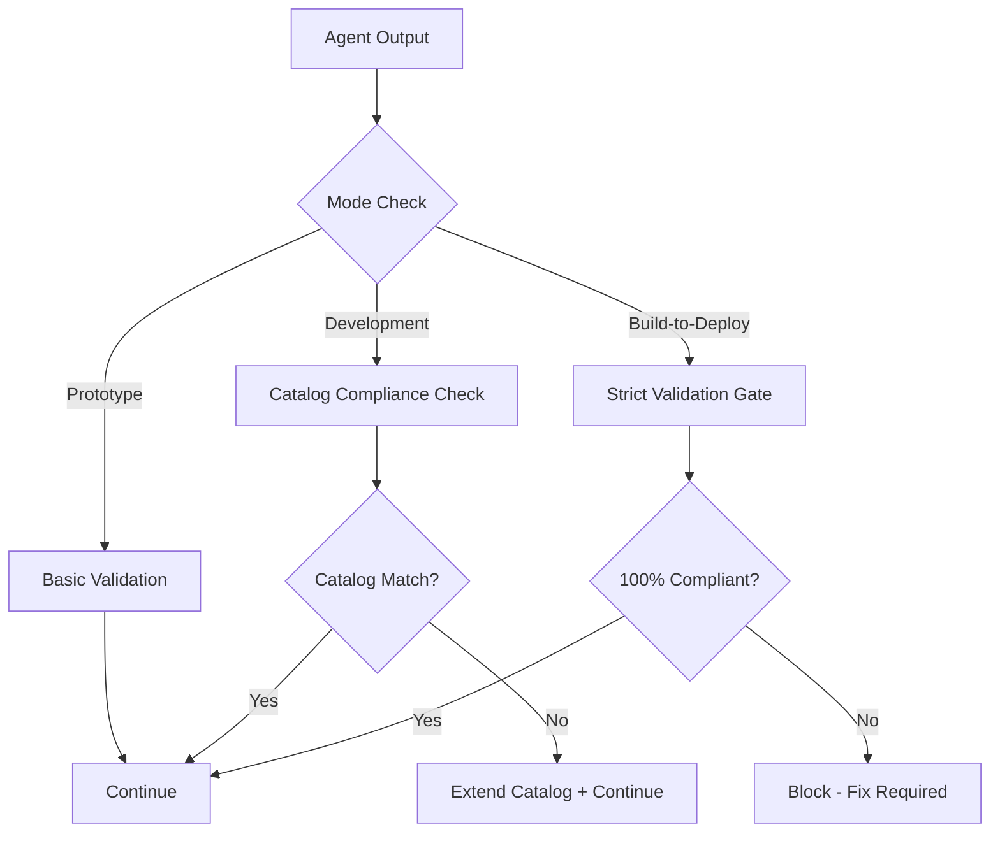

# SEAD-METHOD™: Specification Enforced Agentic Agile Development

**Version**: 1.4 Phase 3 Agent Ecosystem Complete  
**Date**: 2025-01-04 (Final Update)  
**Status**: 12-Agent SEAD Ecosystem Complete - Full Development Capability Operational

## Executive Summary

SEAD-METHOD™ (Specification Enforced Agentic Agile Development) is a hybrid methodology that combines the best of BMAD-METHOD's agentic workflow orchestration with Spec-Kit's constitutional specification-driven development, enhanced by a revolutionary **catalog-based constraint enforcement system**.

**Core Problem Solved**: AI agents lose context between sessions, leading to code/spec drift, inconsistent implementations, and deployment failures.

**Core Solution**: A catalog-based constraint system with three progressive development modes that prevent drift rather than just detecting it, plus automated catalog generation from existing codebases and prototype development.

## Vision Statement

Transform software development into a **factory assembly line approach** where AI agents work within progressively stricter constraints, using a comprehensive catalog of approved components, contracts, and patterns. Enable teams to choose their balance of creativity vs. consistency based on project phase: unlimited experimentation in prototypes, controlled innovation in development, and strict compliance for production deployment.

## Three-Tier Architecture

SEAD-METHOD operates on three aligned tiers that progress from maximum flexibility to maximum consistency:

### Development Modes
| Mode | Purpose | Constraints | AI Behavior | Validation |
|------|---------|-------------|-------------|------------|
| **PROTOTYPE** 🧪 | Rapid experimentation | Minimal - can deviate from catalog | Creative, allows custom solutions | Basic linting |
| **DEVELOPMENT** ⚙️ | Production-ready features | Must use catalog when available, can extend | Prefers catalog, documents new patterns | Type checking, contract validation |
| **BUILD-TO-DEPLOY** 🏭 | Deployment-ready | STRICT - only catalog items | Assembly-line approach, no custom code | Full compliance checking |

### Data Strategy
| Tier | Storage | Schema | Purpose | Extensions |
|------|---------|--------|---------|------------|
| **DEMO** 🎭 | SQLite/JSON | Full production + experimental | Rapid prototyping | ✅ Add freely |
| **MOCK** 🏗️ | Production-like (PostgreSQL) | Production + tracked extensions | Development testing | ⚙️ Track for migration |
| **PRODUCTION** 🏭 | Production database | Catalog-only (no extensions) | Live validation | ❌ Blocked |

### Deployment Strategy
| Tier | Infrastructure | Complexity | Sharing | Validation |
|------|---------------|------------|---------|------------|
| **LOCAL-DEV** 🏠 | Docker Compose | Minimal | Tunnels, local cloud | Health checks |
| **CLOUD-STAGING** ☁️ | Lightweight cloud | Moderate | Branch environments | Integration tests |
| **PRODUCTION-DEPLOY** 🏭 | Full production stack | Complete CI/CD | Blue/green deployment | Full validation |

## The Catalog System

### Agent-Driven Catalog Generation Strategy

SEAD-METHOD uses specialized AI agents instead of rigid scripts for intelligent catalog creation:

**1. Brownfield Analysis**: AI agents analyze existing codebases for pattern extraction
```bash
# Agent-driven catalog generation from existing codebase
sead catalog generate --source ./existing-project --interactive
# Activates: SEAD Catalog Architect + SEAD Pattern Extraction agents
```

**2. Greenfield Bootstrap**: Build catalog incrementally during prototype development
```bash
# Initialize with pattern tracking during development
sead catalog init --mode greenfield --track-patterns
# Capture patterns during implementation
/sead-implement story-001 --mode prototype --capture-patterns
```

**Key Innovation**: AI agents provide intelligent pattern recognition, quality assessment, and catalog organization - far superior to automated script-based extraction.

### Catalog Architecture
```
sead-catalog/
├── api-contracts/           # OpenAPI specs, contract definitions  
├── shared-types/           # TypeScript interfaces, data models
├── design-system/          # Components, patterns, themes
├── state-management/       # Store patterns, action schemas
├── error-handling/         # Error types, handling patterns
├── validation-schemas/     # Input validation, data constraints
├── test-patterns/          # Test templates, fixtures
├── auth-patterns/         # Authentication & authorization
├── integration-patterns/   # External service patterns
├── data-strategy/          # Three-tier data management
│   ├── demo-data/          # JSON fixtures with full schema
│   ├── mock-data/          # Production-scale generators
│   ├── production-schemas/ # Live schema definitions
│   └── seeding-patterns/   # Data initialization templates
└── deployment-strategy/    # Three-tier deployment management
    ├── local-dev/          # Docker Compose, dev scripts
    ├── cloud-staging/      # Lightweight cloud configs
    ├── production-deploy/  # Full CI/CD, infrastructure as code
    └── deployment-contracts/ # Environment configuration contracts
```

### AI Agent Catalog Generation System
```
sead-core/agents/
├── sead-catalog-architect.md         # 🏗️ Expert agent for catalog design & brownfield analysis
└── sead-pattern-extraction.md        # 🔍 Specialist agent for pattern identification & classification

sead-core/tasks/
└── brownfield-catalog-generation.md  # 📋 Complete 5-phase workflow orchestrating both agents

sead-core/workflows/
└── catalog-generation-workflow.yaml  # 🔄 Agent coordination and handoff management
```

**Agent Capabilities**:
- **SEAD Catalog Architect (Morgan)**: Analyzes project structure, designs catalog taxonomy, guides interactive creation
- **SEAD Pattern Extraction (Quinn)**: Identifies patterns across domains, assesses quality, prepares catalog-ready components
- **Coordinated Workflow**: 5-phase process from initial analysis through adoption strategy

### Constraint Enforcement Mechanisms

#### 1. Catalog Reference System
- Every component gets unique catalog ID
- Agent instructions include relevant catalog IDs
- Context preserved across sessions via catalog references

#### 2. Mode-Based Constraint Injection
- Development mode constraints automatically injected into agent prompts
- Constitutional rules enforced at each handoff
- Validation gates prevent progression without compliance

#### 3. Progressive Validation Pipeline


## Integrated SEAD Workflow

### Phase 1: Constitutional Specification
```bash
/specify [feature description] --mode [prototype|development|build-to-deploy] --deploy-target [local|cloud|production]
```
**Enhanced Spec-Kit Process:**
- Creates feature spec using constitutional templates
- Checks catalog for relevant patterns based on mode
- BMAD Analyst validates business requirements
- Identifies data and deployment requirements
- **Output**: Feature spec + mode constraints + data requirements + deployment strategy

### Phase 2: Agentic Planning  
```bash
/plan [tech stack] --catalog-mode [mode] --data-tier [demo|mock|production] --deploy-tier [local-dev|cloud-staging|production-deploy]
```
**Enhanced BMAD Process:**
- BMAD Architect creates technical plan using catalog constraints
- Data Architect designs data layer with tier-appropriate patterns
- Infrastructure Architect designs deployment strategy
- Spec-Kit research agents validate technical choices
- Context preservation through catalog references
- **Output**: Implementation plan + data architecture + deployment architecture + catalog inventory

### Phase 3: Constraint-Aware Story Creation
```bash
/stories --enforce-catalog --data-tier [tier] --deploy-tier [tier]
```
**Context-Preserved Story Creation:**
- BMAD Scrum Master creates detailed stories with catalog references
- Each story includes data setup and deployment validation requirements
- Stories embed catalog compliance checks
- Context window preserved through catalog IDs
- **Output**: Stories with embedded catalog + data + deployment constraints

### Phase 4: Catalog-Driven Implementation
```bash
/implement [story-id] --mode [mode] --data-tier [tier] --deploy-tier [tier]
```
**Assembly-Line Implementation:**
- BMAD Dev agent implements using catalog constraints
- Mode determines flexibility vs. strictness
- Automatic data setup using appropriate tier
- Automatic deployment setup using appropriate tier
- Automatic validation against catalog patterns
- QA agent checks catalog compliance
- **Output**: Implementation + data setup + deployment ready + catalog updates (dev mode only)

## Key Innovations Over BMAD/Spec-Kit

### From BMAD-METHOD
✅ **Inherited**: Rich agent ecosystem, workflow orchestration, expansion pack system
✅ **Enhanced**: Agents now work with catalog constraints and context preservation

### From Spec-Kit  
✅ **Inherited**: Constitutional governance, executable specifications, research agents
✅ **Enhanced**: Constitutional rules now enforce catalog compliance across all agents

### NEW in SEAD-METHOD
🆕 **Catalog-Based Constraint Enforcement**: Prevents drift through progressive constraints
🆕 **Three-Tier Aligned Architecture**: Development, data, and deployment tiers work in harmony
🆕 **Context Preservation System**: Catalog references maintain context across agent sessions
🆕 **Factory Assembly Pipeline**: Build-to-deploy mode ensures "paint by numbers" consistency
🆕 **Progressive Validation Gates**: Mode-based validation prevents issues before they compound
🆕 **Automatic Compliance Checking**: Real-time validation against catalog patterns

## Data Strategy Deep Dive

### Schema Evolution Flow
```
PROTOTYPE Mode (SQLite with Full Schema + Experimental Extensions)
    ↓ 
    [Add experimental fields freely for testing]
    ↓
DEVELOPMENT Mode (PostgreSQL with Production Schema + Tracked Extensions)  
    ↓
    [Extensions tracked for migration planning]
    ↓
PRODUCTION Mode (Production Database with Catalog-Only Schema)
    ↓
    [Extensions become part of catalog after approval]
```

### Data Contract Example
```yaml
# sead-catalog/data-contracts/user-profile.yaml
contract:
  entity: UserProfile
  relationships:
    - belongs_to: User (users.id)
    - has_many: ProfileSettings (profile_settings.user_profile_id)
  constraints:
    - email: unique, validated
    - created_at: immutable
    - status: enum [active, inactive, suspended]
  data_tiers:
    demo: "Hand-crafted examples in SQLite with full schema"
    mock: "Generated via faker.js at production scale in PostgreSQL"  
    production: "Live schema validation, catalog-enforced structure"
  experimental_extensions:
    - preferences: "JSONB field for user preferences (demo/dev only)"
    - theme_mode: "VARCHAR(20) for UI theme selection (dev only)"
  catalog_version: "1.3.0"
```

## Deployment Strategy Deep Dive

### Deployment Pipeline Progression
```
Local Development (Docker Compose)
    ↓
    [Prototype sharing via tunnels, rapid iteration]
    ↓
Cloud Staging (Lightweight cloud deployment)
    ↓
    [Branch environments, integration testing, stakeholder review]
    ↓
Production Deploy (Full CI/CD with blue/green deployment)
    ↓
    [Comprehensive monitoring, automatic rollback, production-grade scaling]
```

### Deployment Contract Example
```yaml
# sead-catalog/deployment-contracts/web-app-environment.yaml
contract:
  application_type: "web-app"
  tiers:
    local-dev:
      infrastructure: "docker-compose"
      requirements:
        startup_time: "< 30 seconds"
        resource_usage: "minimal"
      sharing: ["ngrok", "cloudflare-tunnel"]
        
    cloud-staging:
      infrastructure: "serverless OR lightweight-container"
      requirements:
        startup_time: "< 2 minutes"  
        availability: "99% uptime"
      sharing: ["branch-urls", "pr-environments"]
        
    production-deploy:
      infrastructure: "kubernetes OR managed-containers"
      requirements:
        startup_time: "< 5 minutes"
        availability: "99.9% uptime"
      sharing: ["blue-green-deployment", "canary-releases"]
```

## Context Drift Prevention

### The Problem
Traditional AI-assisted development suffers from:
- **Context Loss**: Agents forget previous decisions across sessions
- **Spec/Code Drift**: Implementation deviates from original specifications  
- **Inconsistent Patterns**: Different agents make conflicting architectural choices
- **Validation Gaps**: Issues discovered too late in the deployment pipeline

### The SEAD Solution
1. **Catalog Reference System**: Every component has a unique ID that preserves context
2. **Progressive Constraints**: Mode-based validation prevents drift at the source
3. **Constitutional Enforcement**: Governance rules applied consistently across all agents
4. **Assembly Line Validation**: Each tier validates the next tier's requirements

## Benefits Summary

### For Development Teams
- **Reduced Context Switching**: Catalog references eliminate "what were we building?" confusion
- **Predictable Deployments**: Progressive validation eliminates deployment surprises
- **Flexible Creativity**: Choose your constraint level based on project phase
- **Faster Iteration**: Prototype mode removes blockers for experimentation

### For Organizations
- **Quality Consistency**: Build-to-deploy mode ensures production standards
- **Risk Reduction**: Progressive validation catches issues early
- **Knowledge Preservation**: Catalog captures organizational patterns and standards
- **Scalable Development**: Factory assembly approach scales to any team size

### For AI Agent Effectiveness
- **Context Preservation**: Catalog IDs maintain context across sessions
- **Constraint Clarity**: Mode-based rules eliminate ambiguous decisions
- **Pattern Reuse**: Catalog provides proven solutions to common problems
- **Validation Automation**: Real-time feedback improves agent decision making

## Future Expansion Possibilities

### Domain Expansion (via BMAD Expansion Packs)
- **Creative Writing**: Apply catalog constraints to story elements, character development
- **Business Strategy**: Catalog of strategic frameworks, market analysis patterns
- **Educational Content**: Reusable curriculum patterns, assessment templates
- **Game Development**: Character archetypes, level design patterns, game mechanics catalog

### Technical Evolution
- **AI Agent Training**: Use catalog patterns to train domain-specific agents
- **Cross-Project Catalogs**: Share proven patterns across multiple projects
- **Community Catalogs**: Open-source collections of proven patterns
- **Enterprise Integration**: Connect to organizational design systems and standards

## Current Implementation Status (2025-01-04 Final Update)

**🎉 PHASE 3 COMPLETE**: SEAD-METHOD now has a **complete 12-agent ecosystem** capable of handling any software development scenario with catalog-driven constraint enforcement!

### ✅ **What's Working Now**
- **📦 Standalone NPM Package**: `@sead-method/core` with zero external dependencies
- **🖥️ Functional CLI**: `sead init`, `sead status`, `sead catalog generate` commands working
- **🤖 Complete Agent Ecosystem**: 12 SEAD agents covering all development roles
  - **Core Agents (5)**: Analyst, Architect, Developer, QA, Scrum Master
  - **Catalog Specialists (2)**: Catalog Architect, Pattern Extraction  
  - **Management Agents (5)**: Master, Orchestrator, Project Manager, Product Owner, UX Expert
- **📚 Complete Catalog System**: 11-domain catalog with three-tier strategies  
- **🏗️ Project Initialization**: Full SEAD project setup with catalog structure
- **📋 Enhanced Workflows**: Catalog-aware development workflows with agent coordination
- **⚙️ Mode Configuration**: Prototype/Development/Build-to-Deploy constraint system
- **🎯 Agent-Driven Catalog Generation**: Brownfield analysis and pattern extraction via AI agents
- **🔍 Multi-Domain Pattern Analysis**: API contracts, types, UI, state, errors, testing, auth, integration
- **🧙 Universal Task Execution**: SEAD Master for cross-domain expertise
- **🎭 Multi-Agent Orchestration**: SEAD Orchestrator for complex workflow coordination

### 🔄 **Next Phase: Constitutional Framework**
- **🏛️ Constitutional Framework**: Integrate Spec-Kit governance and constitutional rules (Phase 4)
- **🔧 CLI Commands**: Complete `specify`, `plan`, `stories`, `implement` implementation  
- **📦 Component Porting**: Remaining BMAD/Spec-Kit components (21 tasks, 12 templates, 6 checklists)

### 💡 **Try It Now**
```bash
# Clone and test the current implementation
git clone [repository] sead-method
cd sead-method
npm install

# Initialize a SEAD project
node cli.js init my-test-project

# Generate catalog from existing codebase
node cli.js catalog generate --source ./existing-project --interactive

# Follow the agent-driven workflow:
# 1. /sead-catalog-architect → *brownfield-analyze
# 2. /sead-pattern-extraction → *pattern-scan  
# 3. Follow brownfield-catalog-generation.md workflow
```

## Getting Started

SEAD-METHOD can be adopted through multiple pathways:

### For Existing Projects (Brownfield)
1. **Agent-Driven Catalog Generation**: Use AI agents to intelligently extract patterns from existing codebase
   ```bash
   sead catalog generate --source ./my-project --interactive
   # Activates SEAD Catalog Architect + Pattern Extraction agents
   ```
2. **Interactive Refinement**: Collaborate with agents to refine catalog quality and organization
3. **Team Adoption**: Follow agent-generated adoption strategy for team onboarding
4. **Progressive Constraint Enforcement**: Move from development to build-to-deploy mode

### For New Projects (Greenfield)
1. **Initialize with Pattern Tracking**: Start prototype development with catalog bootstrap
   ```bash
   sead catalog init --mode greenfield --track-patterns
   ```
2. **Prototype with Capture**: Build initial features while capturing reusable patterns
3. **Agent-Assisted Promotion**: Use catalog agents to evaluate and promote patterns
4. **Scale with Constraints**: Use progressive validation as project matures

### General Implementation Steps
1. **Install SEAD-METHOD**: Set up the standalone system with catalog generation agents
2. **Run Catalog Generation**: Use agent-driven analysis to extract existing patterns
3. **Configure Constraint Modes**: Set up prototype/development/build-to-deploy enforcement
4. **Team Training**: Follow agent-generated adoption strategy and workflow integration  
5. **Progressive Rollout**: Start with development mode, progress to build-to-deploy constraints

## Conclusion

SEAD-METHOD™ represents a paradigm shift from reactive to proactive quality assurance in AI-assisted development. By preventing drift rather than just detecting it, and by providing progressive constraint enforcement aligned across development, data, and deployment strategies, SEAD-METHOD enables teams to harness the full power of AI agents while maintaining the consistency and reliability required for production systems.

The factory assembly line approach—"paint by numbers" or "Legos rather than custom builds"—doesn't eliminate creativity. Instead, it channels creativity into the appropriate phases (prototyping and development) while ensuring production deployments meet organizational standards and requirements.

**Next Steps**: Proceed to implementation planning to transform this vision into a working system.

---

*SEAD-METHOD™ and SEAD™ are proposed trademarks. Built upon the foundations of BMAD-METHOD™ (BMad Code, LLC) and Spec-Kit (GitHub, Inc.).*